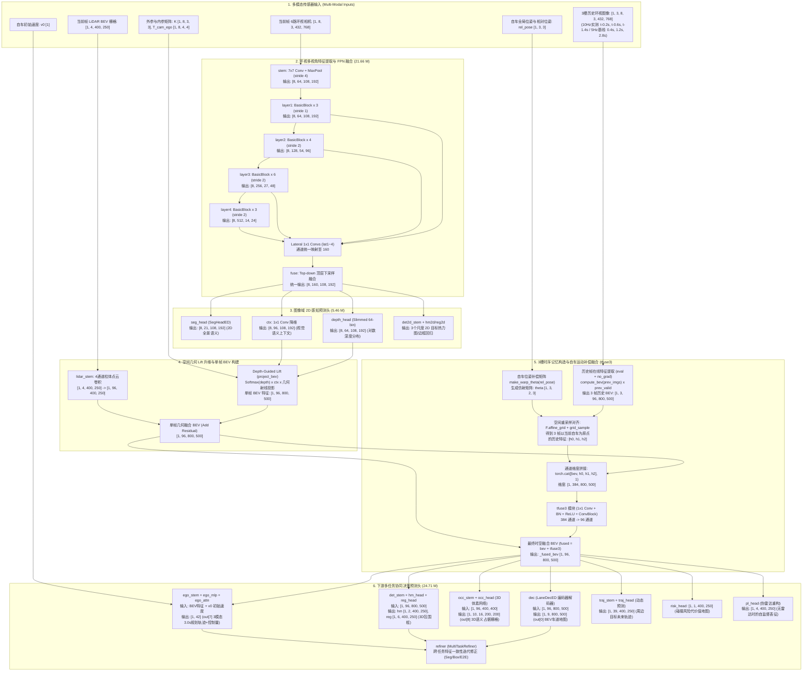

# METEOR 模型网络架构说明书 (Model Architecture Specification)

本文档记录微调训练与部署所采用的核心多模态端到端自动驾驶感知决策模型——**`DepthSegIPMNetV52`** 的完整网络架构、层级连接拓扑、**时序记忆构造与运动补偿融合机制**以及每一层的张量输入输出规范。

---

## 1. 模型概览与基础配置 (Overview & Meta-Information)

| 属性项 | 详细配置说明 |
| :--- | :--- |
| **模型类名** | `DepthSegIPMNetV52`（源码位于 `METEOR/bevlane/model.py` 第 5256 行，继承链贯通 V48、V47、V46 至 V29 时序家族） |
| **基础骨干网络** | ResNet-34 + 顶层自顶向下特征金字塔（FPN Neck） |
| **时序融合开关** | `use_temporal = True`，启用 3 槽历史记忆队列（`hist_n = 3`，对应 `HIST_N = 3`） |
| **轻量化策略** | 深度头通道剪裁（`enable_depth_slim(model, widths=(128, 128, 96, 64))`） |
| **预训练权重** | `METEOR/checkpoints/meteor_v157.pt` (v157 基线) |
| **微调后最佳权重** | `meteor_6cam_lidar_deploy/checkpoints/meteor_custom_v52/best.pt` (Epoch 1) |
| **总参数量** | **51,828,111 (51.83 M)** |
| **可训练参数量** | **50,871,921 (50.87 M)** |
| **输入传感器** | 6 路 1080p 环视去畸变相机 + 1 路 64 线激光雷达 BEV 栅格 + 车身运动学状态 + 3 槽历史图像时序记忆 |
| **核心输出头** | 2D 全景语义、深度分布、BEV 车道地图、3D 目标检测、3D 语义占据、端到端轨迹规划、轨迹预测、风险场 |

---

## 2. 整体网络架构拓扑图 (End-to-End Network Topology)



---

## 3. 逐层网络结构与输入输出张量规格表 (Layer-by-Layer Specifications)

> **张量表示约定**：
> - 批大小 $B=1$
> - 相机槽位数 $N=8$（输入为 6 路实测环视相机 + 2 路兜底长焦通道填充）
> - 图像特征空间尺寸：原图 $432 \times 768 \rightarrow$ 1/4 特征图 $108 \times 192 \rightarrow$ 1/8 图 $54 \times 96 \rightarrow$ 1/16 图 $27 \times 48 \rightarrow$ 1/32 图 $14 \times 24$
> - BEV 空间网格尺寸：车道高分辨率 $800 \times 500$（0.2m/cell，覆盖纵向 $\pm 80\text{m}$、横向 $\pm 50\text{m}$）；检测/时序网格 $400 \times 250$（0.4m/cell）；OCC 栅格 $200 \times 200$（0.4m/cell，覆盖 $\pm 40\text{m}$）

| 序号 | 层/模块名称 | 结构类型 | 输入张量尺寸 | 输出张量尺寸 | 结构配置详情 | 功能描述与数据流向 |
| :---: | :--- | :--- | :--- | :--- | :--- | :--- |
| **1** | `stem` | `Sequential` | `[8, 3, 432, 768]` | `[8, 64, 108, 192]` | 7×7 Conv (stride 2, pad 3) + BN + ReLU + 3×3 MaxPool (stride 2) | 环视相机第一级特征提取与 4 倍下采样 |
| **2** | `layer1` | `ResNet BasicBlock x 3` | `[8, 64, 108, 192]` | `[8, 64, 108, 192]` | 3×3 Conv, stride 1 (残差连接) | 浅层高分辨率纹理特征抽取 |
| **3** | `layer2` | `ResNet BasicBlock x 4` | `[8, 64, 108, 192]` | `[8, 128, 54, 96]` | 3×3 Conv, stride 2 (残差连接) | 中浅层几何特征，降采样至 1/8 尺寸 |
| **4** | `layer3` | `ResNet BasicBlock x 6` | `[8, 128, 54, 96]` | `[8, 256, 27, 48]` | 3×3 Conv, stride 2 (残差连接) | 中深层高级语义特征，降采样至 1/16 尺寸 |
| **5** | `layer4` | `ResNet BasicBlock x 3` | `[8, 256, 27, 48]` | `[8, 512, 14, 24]` | 3×3 Conv, stride 2 (残差连接) | 深层大感受野场景上下文，降采样至 1/32 尺寸 |
| **6** | `lat1~4` | `Conv2d x 4` | 各层特征图 | 各级 `[8, 160, H_i, W_i]` | 1×1 卷积，通道对齐至 160 | FPN 横向连接，统一度量通道宽度 |
| **7** | `fuse` | `Sequential` | `[8, 160, 108, 192]` | `[8, 160, 108, 192]` | 双线性上采样融合 + 3×3 卷积平滑 | 顶层至浅层的金字塔融合特征，输入下游各 2D 头 |
| **8** | `seg_head` | `SegHeadED` | `[8, 160, 108, 192]` | **`[8, 21, 108, 192]`** | U-Net 级联上采样 + 1×1 分类卷积 | **2D 全景语义分割 Logits**（道路/车辆/行人/路沿等 21 类） |
| **9** | `depth_head` | `Sequential (Slimmed)` | `[8, 160, 108, 192]` | **`[8, 64, 108, 192]`** | 4层 3×3 卷积 (128→128→96→64) | **对数离散深度分布 Logits**（64 bins, 1m~80m） |
| **10** | `ctx` | `Conv2d` | `[8, 160, 108, 192]` | `[8, 96, 108, 192]` | 1×1 卷积降维 | 压缩图像特征，作为 Lift 投射到 BEV 的视觉向量 |
| **11** | `det2d_stem` | `ConvBlock` | `[8, 160, 108, 192]` | `[8, 128, 108, 192]` | 3×3 Conv + BN + ReLU | 2D 目标检测多尺度主干 |
| **12** | `hm2d / reg2d` | `Conv2d` | `[8, 128, H_s, W_s]` | `hm: [8, 10, ...], reg: [8, 4, ...]` | 多分支 1×1 卷积 (s0, s1, s2 三尺度) | 图像域 2D 目标中心点热力图与尺寸边界框回归 |
| **13** | **`project_bev`** | **IPM / Lift 算子** | `depth, ctx, K, T_cam_ego` | **`[1, 96, 800, 500]`** | **几何反投影 + Softmax 深度加权 Splatting** | **核心几何升维：将 2D 图像特征投射到 3D/BEV 空间** |
| **14** | `lidar_stem` | `Sequential` | `[1, 4, 400, 250]` | `[1, 96, 400, 250]` | 3×3 卷积残差块 | 4通道 LiDAR BEV 柱体特征提纯，累加至 BEV 特征 |
| **15** | **`compute_bev`** | **辅助时序算子** | `prev_imgs [1, 3, 8, 3, 432, 768]` | **`[1, 3, 96, 800, 500]`** | 在 `eval + no_grad` 下在线提取历史帧单帧 BEV | 训练期构造 3 槽历史记忆队列（10Hz实测为 $t-0.2\text{s}, t-0.6\text{s}, t-1.4\text{s}$；官方5Hz基准下为 $0.4\text{s}, 1.2\text{s}, 2.8\text{s}$） |
| **16** | **`affine_grid + grid_sample`** | **位姿补偿算子** | `hb [1, 3, 96, 800, 500], theta [1, 3, 2, 3]` | **`[1, 3, 96, 800, 500]`** | 双线性插值空间重采样，补偿车辆在这段时间内的位移与偏航 | 将历史时刻自车坐标系重映射并对齐到当前时刻坐标系 |
| **17** | **`tfuse3`** | **`Sequential`** | **`[1, 384, 800, 500]`** | **`[1, 96, 800, 500]`** | 1×1 Conv (384→96, bias=False) + BN + ReLU + ConvBlock(96, 96) | **核心时空特征残差融合**：将当前帧与 3 槽历史 BEV 拼接融合 |
| **18** | `dec` | `LaneDecED` | `[1, 96, 800, 500]` | **`[1, 9, 800, 500]`** | 编码-解码 U-Net + 1×1 分类卷积 | **BEV 车道线与拓扑分割 Logits**（车道线/分道线/斑马线等 9 类） |
| **19** | `det_stem` | `_DetStemED` | `[1, 96, 800, 500]` | `[1, 128, 400, 250]` | 步长为 2 的卷积下采样 | 3D 目标检测 BEV 特征主干 |
| **20** | `hm_head / reg_head` | `Conv2d x 2` | `[1, 128, 400, 250]` | **`hm: [1, 2, 400, 250]`, `reg: [1, 6, 400, 250]`** | 1×1 卷积分类与回归 | **3D 目标包围框**（置信度 + 中心偏移、离地高度、长宽高、朝向角） |
| **21** | `occ_stem` | `Sequential` | `[1, 96, 400, 400]` | `[1, 192, 200, 200]` | 3×3 卷积步长 2 下采样 | 3D 空间几何占用走廊特征提取 |
| **22** | **`occ_head`** | `Conv2d` | `[1, 192, 200, 200]` | **`[1, 160, 200, 200]`** (变形为 **`[1, 10, 16, 200, 200]`**) | 1×1 卷积映射至 $10 \times 16 = 160$ 通道 | **3D 语义占据体素 Logits**（10 类别 $\times$ 16 层竖直高度 $Z$ $\times$ 200m 空间） |
| **23** | `ego_stem` | `Sequential` | `[1, 96, 800, 500]` | `[1, 256, 1, 1]` | 级联卷积与自适应平均池化 | 压缩全局自车行驶场景上下文为固定语义向量 |
| **24** | **`ego_mlp`** | `Sequential` | `[1, 257]` (拼接自车车速 $v_0$) | **`[1, 42]`** | 3层全连接网络 (Linear + ReLU) | **端到端 3.0s 轨迹规划**（3模式 $\times$ 6航向点 $(x,y)$ + 置信度 + 转角/加速度/制动） |
| **25** | `ego_attn` | `MultiheadAttention` | `Query: [1, 3, 96], Key/Value: [1, 400, 96]` | `[1, 3, 96]` | 8-Head 交叉注意力机制 | 自车规划轨迹与 BEV 关键路口/动态障碍物交互强化 |
| **26** | `traj_stem / head` | `Sequential + Conv2d` | `[1, 192, 800, 500]` | **`[1, 39, 400, 250]`** | 空间时序卷积 | 动静态交通参与者未来 3.0s 轨迹预测（借用 $t-0.4\text{s}$ 残差特征） |
| **27** | `stat_head` | `Conv2d` | `[1, 128, 400, 250]` | `[1, 1, 400, 250]` | 1×1 卷积 + Sigmoid | 障碍物静态/静止状态分类概率图 |
| **28** | `risk_head` | `Sequential` | `[1, 96, 400, 250]` | `[1, 1, 400, 250]` | 2层 3×3 卷积 | 碰撞风险代价场（Risk Cost Field） |
| **29** | `pl_head` | `Sequential` | `[1, 96, 800, 500]` | `[1, 4, 400, 250]` | 3×3 卷积反卷积 | 纯视觉直接重构伪激光雷达（Pseudo-LiDAR）栅格 |
| **30** | `refiner` | `MultiTaskRefiner` | `seg, hm, reg, ego, fused` | 同输入格式的修正增量 | 跨任务残差细化网络 | 多任务联合一致性校验，提升极端工况稳定性 |

---

## 4. 时序构造输入与自车运动补偿融合机制 (Spatio-Temporal Memory & Fusion)

在微调训练时，单帧视觉输入无法完全捕捉道路动态与时序拓扑连续性。`DepthSegIPMNetV52` 内置了完整的 3 槽时空记忆构造与仿射对齐机制：

### 4.1 触发判定与槽位配置
- `METEOR/bevlane/train.py:1874`：模型版本判定分支明确将 `v52` 归入 `use_temporal = True` 架构族群；
- `METEOR/bevlane/train.py:1893`：设置 `hist_n = 3`，即激活 **3 槽时序记忆队列（3-Slot Temporal Memory Queue）**。

### 4.2 多尺度历史帧采样跨度与时间换算

`METEOR/bevlane/dataset.py:591` 中固定以**帧索引偏移（Frame Offsets）**定义采样跨度：`OFFS = (2, 6, 14)`。

**不同采样频率下的物理时间跨度对比**：
| 历史槽位 (Slot) | 帧索引偏移 (`fi - off`) | **本次实测数据集 (10 Hz, $\Delta t=0.1\text{s}$)** | 官方预训练基线 (5 Hz, $\Delta t=0.2\text{s}$) | 主要感知与运动学物理功能 |
| :--- | :---: | :---: | :---: | :--- |
| **Slot 0** | 前第 **2** 帧 (`fi - 2`) | **$t - 0.2\text{s}$** (即 200 ms) | $t - 0.4\text{s}$ | 捕捉即时高频动态（前车启停减速、本车转向角速度、微小横摆率） |
| **Slot 1** | 前第 **6** 帧 (`fi - 6`) | **$t - 0.6\text{s}$** (即 600 ms) | $t - 1.2\text{s}$ | 捕捉中程车道跟随稳定性与纵横向平移位姿补偿 |
| **Slot 2** | 前第 **14** 帧 (`fi - 14`) | **$t - 1.4\text{s}$** (即 1400 ms) | $t - 2.8\text{s}$ | 捕捉大尺度路网拓扑走廊与远距离几何特征滤波 |

> [!NOTE] 官方注释中的 `t-0.4s` 溯源
> 官方源码（如 `model.py:2913` 的 `# warped t-0.4s slot` 及 `probe_hist_bias.py` 的测试说明）中之所以出现 $0.4\text{s} / 1.2\text{s} / 2.8\text{s}$，是因为官方原始训练集基于 **5 Hz Keyframe** 采样（$0.2\text{s}/\text{帧}$）。
> 在我们本次实测的 **10 Hz** 系统下，前第 2 帧严格对应 **$0.2\text{s}$**。由于几何运动补偿 `make_warp_theta(rel_pose)` 是根据两帧间的全局真值位姿 $(\Delta x, \Delta y, \Delta \text{yaw})$ 实时生成的，因此空间网格对齐始终 100% 严格几何保真，且 10 Hz 下更密集的历史采样能提供更灵敏的高动态响应。

### 4.3 训练期在线记忆队列构造流程 (`train.py:2931-2938`)
```python
net00 = model.module if ddp else model
model.eval()  # 必须切入 eval 模式，严防辅助历史提取污染 BatchNorm running_mean/var
pbs, ths = [], []
with torch.no_grad(), torch.autocast("cuda", torch.float16):
    for hi in range(hist_n):
        # 1. 现算单帧历史 BEV 并屏蔽无效填充帧 (prev_valid=0)
        pbs.append(net00.compute_bev(prev_imgs[:, hi], K, Tc) * prev_valid[:, hi].view(-1, 1, 1, 1))
        # 2. 从 ego_motion.npz 的全局位姿计算相对位姿变换仿射矩阵
        ths.append(make_warp_theta(rel_pose[:, hi]))
model.train()
pb = torch.stack(pbs, 1).float()       # [B, 3, 96, 800, 500]
theta = torch.stack(ths, 1)            # [B, 3, 2, 3]
```
> **设计安全规范**：
> - 历史特征计算严格限定在 `torch.no_grad()` 与独立的 `autocast` 上下文中，切断历史前向对当前梯度的隐式显存缓存；
> - 场景起始前 14 帧缺乏足够历史数据时，`prev_valid` 自动置 0，历史 BEV 置为全零张量，`rel_pose` 恒等对齐，完全保证数值稳定性。

### 4.4 运动补偿空间重对齐与残差融合 (`model.py:2902-2915`)
在主模型前向传播的 `temporal_fuse(bev)` 中：
1. **空间仿射 Warp**：
   ```python
   for i in range(HIST_N):
       grid = F.affine_grid(th[:, i].to(bev.dtype), list(bev.shape), align_corners=False)
       warped_h = F.grid_sample(hb[:, i].to(bev.dtype), grid, align_corners=False)
       cat.append(warped_h)
   ```
   通过坐标仿射映射，将原本处于各历史时刻自车位置的地面特征，按自车实际行驶位移与航向偏角精准重投影至当前时刻自车 BEV 坐标系中。
2. **时空特征通道拼接与提纯**：
   拼接张量 `torch.cat([bev, h0, h1, h2], 1)` 形状为 **`[B, 384, 800, 500]`**（$96 \times 4 = 384$ 通道）；
   送入 `tfuse3` 模块（包含 1×1 卷积降维至 96 维 + BN + ReLU + 3×3 ConvBlock）；
   采用残差学习策略：
    $$\text{BEV}_{\text{fused}} = \text{BEV}_{\text{curr}} + \text{tfuse3}([\text{BEV}_{\text{curr}}, \text{BEV}_{\text{Slot0}}^{\text{warp}}, \text{BEV}_{\text{Slot1}}^{\text{warp}}, \text{BEV}_{\text{Slot2}}^{\text{warp}}])$$
    其中在 10 Hz 实测系统中，$\text{Slot0} \sim t-0.2\text{s}, \text{Slot1} \sim t-0.6\text{s}, \text{Slot2} \sim t-1.4\text{s}$（在官方 5 Hz 基线中对应 $0.4\text{s}, 1.2\text{s}, 2.8\text{s}$）。
    最后一层 BN 权重在初始化时清零（Zero-init），确保模型在初始步等价于单帧模型，梯度实现无震荡平滑迁移。

### 4.5 训练与推理部署的关键工程差异（重点注意）
- **训练期机制**：内存队列是在线从历史图像张量通过网络辅助前向计算出来的；
- **部署期（TensorRT / Orin）机制**：推理引擎绝不重复计算过去 14 帧的图像，而是采用 **自循环环形特征缓存（Recurrent Rolling Buffer）**，将前一帧的推理 BEV 特征缓存在显存中直接参与下一帧的 `grid_sample` 补偿与 `tfuse3` 融合；
- **⚠️ 部署导出特别警示**：
  后续如果将本轮微调后的最优权重（`best.pt`）导出为 ONNX 或 TensorRT 引擎，**绝对不能盲目加上 `--no-hist` 参数**！
  如果添加 `--no-hist`，导出转换脚本会直接裁除 `tfuse3` 分支，将模型退化为纯单帧架构，从而白白浪费微调训练中已经充分优化的时序平滑与滤波能力；
- **微调梯度的全量渗透**：
  在本轮微调中，虽然 `--box-w 0.0`、`--traj-w 0.0` 等任务权重被置零，但 `tfuse3` 位于整个网络从感知到决策的最核心主干交汇处。**车道线分割（`seg-w 1.0`）、3D占据栅格（`occ-w 0.5`）以及端到端轨迹规划（`ego-w 1.0`）的反向传播梯度均 100% 穿透并更新了 `tfuse3` 的全部参数**，使其充分学习到了贴合自建 6 相机与激光雷达数据的时序运动感知表征。

---

## 5. 模型参数量分布统计 (Parameter Distribution)

```
================================================================================
模块功能分组 (Module Group)           参数量 (Parameters)    占比 (Ratio)
================================================================================
1. 环视多视角特征提取主干 (ResNet-34)    21.28 M               41.1 %
2. 特征金字塔颈部网络 (FPN Neck)         0.38 M                0.7 %
3. 图像域 2D 感知头 (Depth / Seg2D)      5.46 M               10.5 %
4. 多模态融合与前置 Stem (LiDAR/Map)     0.38 M                0.7 %
5. 时序记忆对齐与融合模块 (tfuse3)       0.33 M                0.6 %
6. BEV 车道地图解码器 (Lane Decoder)     4.10 M                7.9 %
7. 3D 目标检测头 (3D Bounding Box)       2.06 M                4.0 %
8. 3D 语义占据栅格头 (3D Occupancy)      0.70 M                1.3 %
9. 端到端轨迹规划决策头 (E2E Planning)   4.08 M                7.9 %
10. 时序轨迹预测与碰撞风险代价场          1.76 M                3.4 %
11. 跨任务一致性修正网络 (Refiner)       5.03 M                9.7 %
--------------------------------------------------------------------------------
总计 (Total Parameters)                  51.83 M (51,828,111)  100.0 %
可训练参数量 (Trainable)                 50.87 M (50,871,921)   98.2 %
================================================================================
```

---

## 6. 模型输出元组 (Output Tuple Indices) 完整索引

当在 Python 或 PyTorch 中调用 `out = model(imgs, K, Tc, lidar=..., lidar_bev=...)` 时，返回的 19 元组结构定义如下：

| 元组索引 | 张量形状 (Tensor Shape) | 物理含义与用途 |
| :---: | :--- | :--- |
| `out[0]` | `[B, 9, 800, 500]` | **BEV 车道线与路面语义 Logits**（车道线/分界线/路沿/人行横道等 9 类） |
| `out[1]` | `[B, 8, 64, 108, 192]` | **环视相机 64-bin 离散深度概率分布 Logits**（1.0m~80.0m 对数间隔） |
| `out[2]` | `[B, 8, 21, 108, 192]` | **环视相机 2D 全景语义分割 Logits**（道路/车辆/行人等 21 类） |
| `out[3]` | `[B, 2, 400, 250]` | **3D 目标检测中心点热力图 Logits**（类别 0/1） |
| `out[4]` | `[B, 6, 400, 250]` | **3D 目标检测框回归参数**（$\Delta x, \Delta y, z, w, l, \text{yaw}$） |
| `out[5]` | `tuple(len=3)` | 2D 目标检测热力图金字塔（$s0, s1, s2$ 尺度） |
| `out[6]` | `tuple(len=3)` | 2D 目标检测边框回归金字塔（$s0, s1, s2$ 尺度） |
| `out[7]` | `[B, 42]` | **端到端自车未来运动规划**（3模式 $\times$ 6航向点 $(x,y)$ + 3模式置信度 + 转角/加速度/制动） |
| `out[8]` | `[B, 10, 16, 200, 200]` | **3D 语义占据体素网格 Logits**（10个语义类别 $\times$ 16层 $Z$ 轴体素 $\times$ 200m 空间） |
| `out[9]` | `[B, 39, 400, 250]` | 周边交通参与者未来 3.0 秒轨迹时序预测 |
| `out[10]` | `[B, 1, 400, 250]` | 车辆静态/静止概率图 |
| `out[11]` | `[B, 4]` | 红绿灯信号识别状态（红/黄/绿/未激活） |
| `out[12]` | `[B, 1, 400, 250]` | 动态碰撞风险场代价图（Collision Risk Cost Field） |
| `out[13]` | `[B, 2, 200, 200]` | BEV 场景运动流场（Scene Flow vectors） |
| `out[14]` | `[B, 24, 12, 2]` | 拓扑车道图航向节点坐标（Lane Graph Waypoints） |
| `out[15]` | `[B, 24, 4]` | 车道拓扑图元数据属性 |
| `out[16]` | `[B, 24, 24]` | 车道图连接性邻接矩阵（Adjacency Matrix） |
| `out[17]` | `[B, 1, 400, 250]` | 密集微小静态未知障碍物检测图（Dense Unknown Obstacles） |
| `out[18]` | `[B, 4, 400, 250]` | 伪激光雷达特征重构图（Pseudo-LiDAR 4-Channel Raster） |

---

## 7. 验证与诊断脚本 (Verification Script)

如需重新测量或打印某一层级的张量尺寸与参数详情，可在部署目录下执行诊断脚本：
```bash
docker exec meteor_run python3 /work/meteor_6cam_lidar_deploy/scripts/trace_model.py
```
该脚本将动态挂载 PyTorch Forward Hook，输出每个模块在真实推理状态下的实际张量形状。
