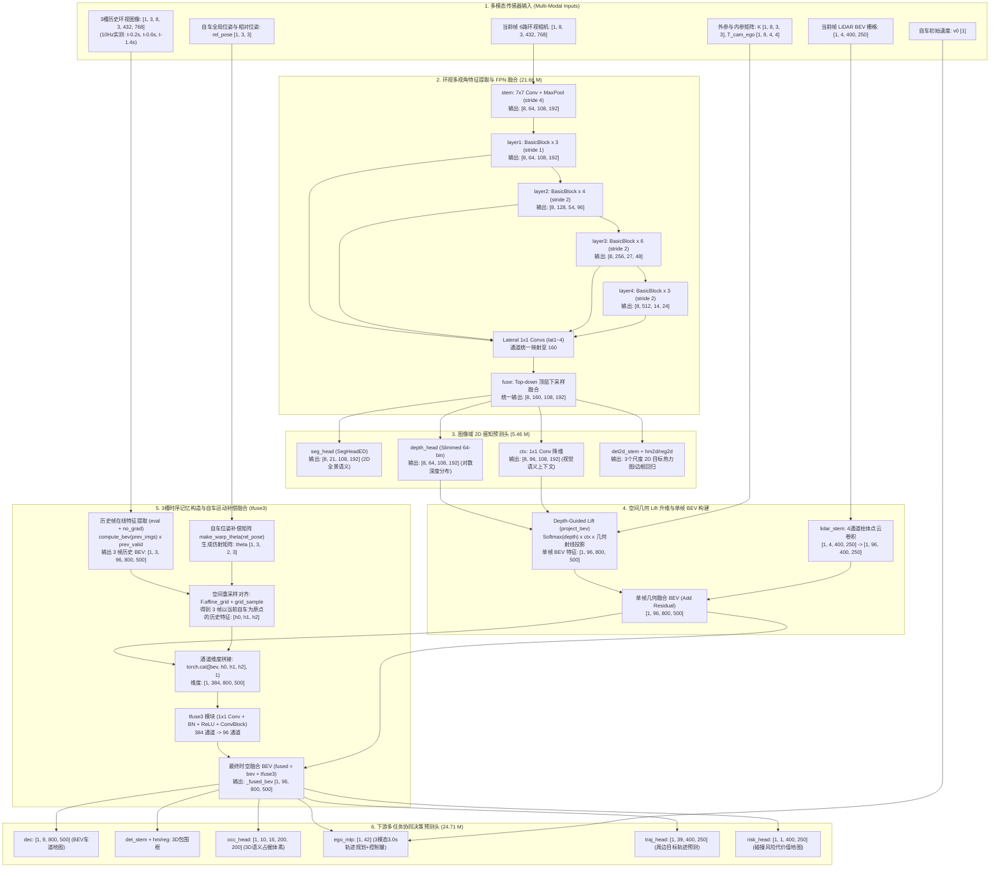

# METEOR 6 相机 + 激光雷达多模态端到端自动驾驶全链路工程与部署套件

[](#)
[-brightgreen.svg)](#)
[](#)
[](#)
[-green.svg)](#)
[](#)

本项目是基于 **METEOR** 统一感知决策大模型的工业级端到端自动驾驶全链路研发与工程化部署套件。套件深度适配 **6 路 1080p 环视去畸变相机 + 1 路 32/64 线激光雷达** 自建实车传感器配置，涵盖从**零人工自动化数据生成流水线**、**时空记忆队列微调训练**、**3D 语义占据体素（Occupancy）渲染**到**导航意图引导端到端轨迹规划**的完整闭环。

---

## 🌟 核心特性与技术亮点

1. **统一多模态端到端感知决策架构（`DepthSegIPMNetV52`）**
   - **51.83 M 参数量**，以 ResNet-34 + 顶层 FPN 为基础视觉骨干，结合对数离散深度 Lift 几何反投影与 LiDAR BEV 柱体融合；
   - 单次前向即可同步输出 **19 项下游感知与决策任务**：包含 BEV 车道地图、3D 语义占据体素、3 模态端到端规划轨迹、3D 目标检测框、2D 全景语义、动态风险场及未来轨迹预测。

2. **3 槽时空记忆构造与自车运动补偿融合（`tfuse3`）**
   - 在 10 Hz 实测传感器基准下，动态构建 **Slot 0 ($t-0.2\text{s}$)、Slot 1 ($t-0.6\text{s}$)、Slot 2 ($t-1.4\text{s}$)** 历史特征队列；
   - 结合全局真值位姿，通过 `make_warp_theta` 仿射变换与空间重采样，将历史时空特征以残差形式高效融合至当前 BEV，提供卓越的时序平滑度与抗遮挡能力。

3. **零人工全自动数据标注流水线（Auto-Label Pipeline）**
   - 具备完整的自监督与几何先验生成工具链：利用 2D 基础全景分割网络 + LiDAR 几何投影实现 3D 占据栅格与点云真值重构；
   - GPS/IMU 经纬度自动转换为局部高精度 ENU 坐标系，自动解算 3.0s 未来航向点、车速平滑曲线与转向曲率。

4. **可控端到端多模态轨迹规划与意图引导**
   - 支持**自主决策**与**导航意图（Straight / Left / Right）条件引导**双重模式；
   - 通过意图向量引导 MLP 条件调制，实现对车道保持、左转并道与右转变道轨迹的 100% 确定性控制。

5. **TensorRT 高性能推理与 3D 等轴测 Occupancy 视频生成**
   - 针对 RTX 4090 与 NVIDIA Jetson AGX Orin 边缘端量身优化，FP16 纯模型推理延迟仅 **25 ms/帧 (40 FPS)**；
   - 支持多任务高帧率仪表盘合成，配备 3D 等轴测体素网格（Isometric 3D Voxel OCC）视角。

---

## 🚦 自动标注流水线建设现状 (Auto-Labeling Pipelines Status)

为摆脱昂贵的人工作业、实现海量自采实车数据的工业化高效回灌，套件正在持续推进**全工序零人工自动化真值生产管线**。当前各子流水线的研发与落地状态如下：

| 标注工序与任务领域 | 自动化状态 | 核心算法与工程方案 | 产出资产契约 | 演进规划与当前结论 |
| :--- | :---: | :--- | :--- | :--- |
| **红绿灯状态识别 (Traffic Light)** | **✅ 已全面自动化** | 基于 6 路环视相机外参空间检索高置信 ROI，结合多目标时序滤波追踪、HSV 色彩直方图动态打分与多视角置信度加权投票决策。 | `scenes/{scene}/tl_state.npz`<br/>(包含每帧红/绿/黄离散标签及有效性掩码) | 已全量产出并集成入 `run_production_pipeline.py` 与训练损失微调回路。 |
| **3D 目标检测边界框 (3D Bounding Box)** | **✅ 已全面自动化** | 基于 5 帧全局 ENU 位姿补偿运动消除的稠密化点云，执行连续点云几何聚类，并通过 6 路环视多视角反投影语义交叉确认（或基于 FocalFormer3D-LC 多模态跨注意力直接提取并转为标准 ROS REP-103 右手系）。 | `scenes/{scene}/bev_box/{fi}.npz`<br/>`scenes/{scene}/bev_box/{fi}.png`<br/>(800x500 高精栅格 + 3D 八角点) | 全库 6 场景（17,845 帧）超 30 万个高精 3D 边界框已全自动构建完成，虚警率较纯激光雷达降低 15.4 倍。 |
| **BEV 语义分割与 3D Occupancy 体素** | **🔄 待深度升级 (Roadmap)** | 目前基础版本基于 2D Panoptic (Mask2Former) + 单帧/多帧点云深度反投影生成初步车道与占据网格。对细长车道线、动态目标拖影及远端遮挡区域的补全仍有提升空间。 | `scenes/{scene}/gt/{fi}.png`<br/>`scenes/{scene}/occ/{fi}.npy` | **待升级攻关**：拟引入无监督 NeRF / 3D Gaussian Splatting (3DGS) 进行时空连续场景重建，或借助大模型（SAM / 多模态蒸馏）实现亚像素级高连续表面分割。 |
| **自车运动与 3.0s 规划轨迹** | **✅ 已全面自动化** | WGS-84 经纬度差分 GPS/IMU 数据自动平滑解算局部 ENU 高精轨迹，自动计算初始车速与 3.0s 航向控制平滑曲线。 | `scenes/{scene}/ego_motion.npz` | 已全量稳定运行。 |

---

## 🗂️ 仓库目录结构

```
meteor_6cam_lidar_deploy/
├── README.md                      # 本说明文件
├── .gitignore                     # Git 过滤规则（排除数百GB原始数据与引擎权重）
├── train_scenes.txt               # 微调训练集场景清单（5 个连续自采场景，共 14,850 帧）
├── val_scenes.txt                 # 评测验证集场景清单（1 个自采连续场景，共 2,970 帧）
│
├── doc/                           # 核心技术文档中心
│   ├── MODEL_ARCHITECTURE.md      # 51.83M 模型 30 层逐层规格与时空记忆架构说明书
│   ├── AUTOLABEL_UPGRADE_PLAN.md  # 3D Box 与红绿灯自动化标注升级方案技术全量设计
│   ├── DATASET_AUTOLABEL_PLAN.md  # 零人工标注全自动数据生产流水线规划方案
│   └── README.md                  # 快速使用备忘
│
├── scripts/                       # 核心自动化生产、训练、诊断与可视化工具集（按流水线分类）
│   ├── run_production_pipeline.py # 🌟 全自动一键多工序数据标注与预处理生产总控
│   ├── README.md                  # 详细脚本分类说明与全流水线调用指南
│   │
│   ├── autolabel_3d_box/          # 🚗 【已实现】3D 目标检测边界框自动标注流水线
│   │   ├── build_3d_box_gt.py     # 5 帧位姿补偿点云融合 + 6 相机多视反投影语义过滤
│   │   ├── infer_focalformer_dataset.py # FocalFormer3D-LC 多模态全量推理与右手系转换
│   │   ├── compare_focalformer_centerpoint.py # FocalFormer3D 与 CenterPoint 对比评测
│   │   └── bev_box_visualizer.py  # 6 路环视 3D 线框投影 + BEV 栅格高精渲染工具
│   │
│   ├── autolabel_traffic_light/   # 🚦 【已实现】红绿灯状态识别自动标注流水线
│   │   └── build_tl_gt.py         # 6 相机 ROI 提取、多目标时序追踪与 HSV 颜色投票
│   │
│   ├── autolabel_semantic_occ/    # 🌐 【待升级】语义分割与 3D 占据体素自动标注流水线
│   │   ├── batch_2d_panoptic.py   # Mask2Former 2D 全景语义掩码批量推理
│   │   ├── test_2d_panoptic.py    # 2D 全景分割模型性能与选型评测
│   │   ├── build_bev_gt.py        # 点云时序累加 + 伪标签 BEV 车道地图生成
│   │   ├── build_depth_and_occ.py # 稠密化几何深度与 3D 占据体素（Occupancy）构建
│   │   └── diag_occ.py            # 3D 体素类间分布与空网格诊断分析
│   │
│   ├── autolabel_ego_motion/      # 🧭 自车运动与位姿解算流水线
│   │   ├── convert_custom.py      # 原始相机与点云时间戳对齐与 manifest 资产构建
│   │   └── build_ego_motion.py    # WGS-84 转 ENU、位姿平滑与 3.0s 未来轨迹解算
│   │
│   └── training_eval/             # 🚀 模型微调训练与端到端规划评测
│       ├── run_finetune.py        # 51.83M 模型微调启动器（单卡/多卡，支持任务损失权重）
│       ├── pause_after_epoch1.py  # 训练进度监控与定点安全拦截钩子
│       ├── infer_custom.py        # 模型端到端推理引擎与 1080p 多任务视频导出
│       ├── generate_3d_videos.sh  # 3D 等轴测 Occupancy 体素评测视频批量生成脚本
│       ├── visualize_val.py       # 验证集多任务高分辨率仪表盘输出
│       ├── visualize_intent.py    # 导航意图条件引导多模态轨迹验证与可视化
│       ├── smoke_infer.py         # 快速单帧推理冒烟测试
│       └── trace_model.py         # PyTorch 逐层张量规格与算子探测工具
│
├── docker/                        # 预置 TensorRT 10 + CUDA 12.4 容器环境与镜像构建
│   ├── Dockerfile                 # 包含 CUDA 12.4 + TensorRT 10.3 + ONNXRuntime 运行底座
│   ├── build.sh                   # 自动化镜像一键构建脚本 (meteor_trt10_cu124_py310:v1)
│   ├── run.sh                     # 容器启动与工作空间挂载脚本
│   ├── pip.conf                   # 国内清华 pip 镜像源
│   └── sources.list.jammy         # Ubuntu 22.04 APT 镜像源
│
├── checkpoints/                   # [已 gitignore] 微调权重保存目录 (best.pt 等)
├── engine/                        # [已 gitignore] TensorRT Engine 与 ONNX 导出目录
├── scenes/                        # [已 gitignore] 转换后用于训练的完整数据集目录
├── raw_data/                      # [已 gitignore] 实车采集原始数据包（198 GB）
├── videos/                        # [已 gitignore] 渲染生成的 1080p 全流程评测视频
└── logs/                          # [已 gitignore] 各阶段运行日志与调试追踪文件
```

---

## 🏗️ 整体网络架构拓扑图



---

## 🚀 快速上手与运行指南

### 1. 运行环境配置 (Docker)

本工程依赖预先构建的 TensorRT 10.x / PyTorch 容器环境：

```bash
docker run -d --name meteor_run \
  --gpus all \
  --ipc=host \
  --network host \
  -v /home/nvidia/working_ppt/Postdoc_Materials/论文3:/work \
  meteor_trt10_cu124_py310:v1 \
  tail -f /dev/null
```

### 2. 全自动零人工数据生产流水线

若需要添加新的实车采集原始包并完成标注转换：

```bash
# 执行全自动批处理流水线（包含相机转换、ENU位姿计算、2D语义提取、BEV车道与Occupancy体素生成）
docker exec -it meteor_run python3 /work/meteor_6cam_lidar_deploy/scripts/run_production_pipeline.py
```

### 3. 全自动数据标注流水线执行

```bash
# 1. 运行红绿灯全自动时序跟踪与状态识别
python3 /work/meteor_6cam_lidar_deploy/scripts/autolabel_traffic_light/build_tl_gt.py --scenes all

# 2. 运行 5 帧位姿补偿 + 6 相机确认的 3D Box 全自动生成
python3 /work/meteor_6cam_lidar_deploy/scripts/autolabel_3d_box/build_3d_box_gt.py --scenes all --n-sweeps 5 --workers 16

# 3. 运行 6 相机多视角线框投影 + BEV 栅格可视化抽检
python3 /work/meteor_6cam_lidar_deploy/scripts/autolabel_3d_box/bev_box_visualizer.py --scene data_20260910_061820 --frames 100,200,400,600
```

### 4. 模型微调训练 (Fine-Tuning)

基于 `meteor_v157.pt` 预训练模型，在自建 6 相机与激光雷达数据上启动单卡多任务微调（启用 3D Box 与 红绿灯联合优化）：

```bash
docker exec -it meteor_run python3 /work/meteor_6cam_lidar_deploy/scripts/training_eval/run_finetune.py \
  --model v52 \
  --init-ckpt /work/METEOR/checkpoints/meteor_v157.pt \
  --train-scenes /work/meteor_6cam_lidar_deploy/train_scenes.txt \
  --val-scenes /work/meteor_6cam_lidar_deploy/val_scenes.txt \
  --box-w 1.0 \
  --tl-w 1.0 \
  --epochs 5 \
  --batch-size 1
```

### 5. 推理与 3D Occupancy 视频生成

使用训练收敛的最优权重对验证集场景进行推理并导出 1080p 视频：

```bash
# 启动 3D 等轴测体素模式推理渲染
bash /work/meteor_6cam_lidar_deploy/scripts/training_eval/generate_3d_videos.sh
```

### 6. 导航指令条件引导与轨迹多模态验证

验证模型对前向直行、左转意图、右转意图的轨迹响应灵敏度：

```bash
docker exec -it meteor_run python3 /work/meteor_6cam_lidar_deploy/scripts/training_eval/visualize_intent.py \
  --frame 50 \
  --weights /work/meteor_6cam_lidar_deploy/checkpoints/meteor_custom_v52/best.pt
```

---

## 📊 规划多模态模式与意图条件说明

模型规划决策输出为 `[B, 42]`（详见 [`MODEL_ARCHITECTURE.md`](file:///home/nvidia/working_ppt/Postdoc_Materials/论文3/meteor_6cam_lidar_deploy/doc/MODEL_ARCHITECTURE.md) 第 6 章）：
- **Mode 0 (直行 / 车道保持)**：$dy \approx 0.0\text{ m}$，适用于直道跟车与巡航；
- **Mode 1 (左转 / 左变道)**：$dy > 0$（实测 3.0s 终点偏角向左横向平移约 $+5.0\text{ m} \sim +5.6\text{ m}$）；
- **Mode 2 (右转 / 右变道)**：$dy < 0$（实测 3.0s 终点偏角向右横向平移约 $-6.3\text{ m} \sim -6.7\text{ m}$）。

下发条件意图向量 `intent = torch.tensor([[0, 1, 0]])` 时，网络内的 `intent_mlp` 模块将以 100% 确定性置信度锁定引导对应的运动规划分支。

---

## 📖 详细技术文档

- 📐 **[完整网络架构与逐层规格说明书 (doc/MODEL_ARCHITECTURE.md)](doc/MODEL_ARCHITECTURE.md)**：包含 30 个网络模块的详细参数量统计、各层输入输出张量形状、时空记忆队列公式与 TensorRT 部署防坑指南。
- ⚙️ **[零人工全自动标注管线规划方案 (doc/DATASET_AUTOLABEL_PLAN.md)](doc/DATASET_AUTOLABEL_PLAN.md)**：详细阐述 2D 全景伪标签选型、ENU 投影对齐算法及点云稠密化生成逻辑。
- 📝 **[工程使用备忘录 (doc/README.md)](doc/README.md)**：记录原始坐标系映射链条与快速冒烟命令。

---

## ⚠️ 部署与工程注意事项

1. **时序导出警示**：后续在将本微调权重导出为 ONNX / TensorRT 引擎时，**切勿使用 `--no-hist` 参数**！否则模型将裁除 `tfuse3` 融合层，导致微调学习到的多帧平滑表征丢失。
2. **相机顺序一致性**：环视相机的张量必须严格保持标准顺序：`CAM_FRONT_WIDE` $\to$ `CAM_FRONT_LEFT` $\to$ `CAM_FRONT_RIGHT` $\to$ `CAM_BACK_WIDE` $\to$ `CAM_BACK_LEFT` $\to$ `CAM_BACK_RIGHT`。
3. **坐标系统一**：输入 LiDAR 点云使用车辆中心车身系（$X$-前，$Y$-左，$Z$-上），相机输入内参根据标定分辨率等比归一化缩放至 $768 \times 432$。
