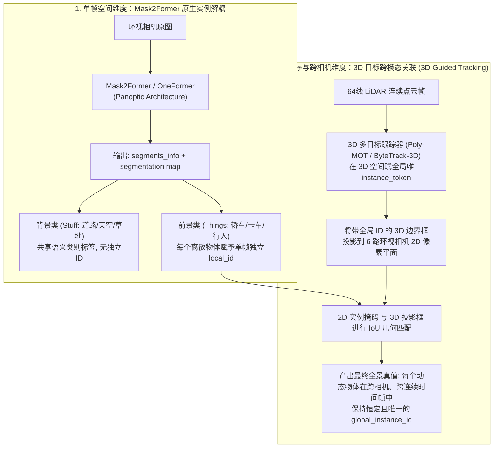

# METEOR 高阶全自动打标升级实施方案 (Advanced Autolabeling Upgrade Specification)

本文档面向 **3D 目标检测框（--box-w 1.0）**、**红绿灯状态与属性检测（--tl-w 1.0）** 以及 **2D 全景实例分割（语义类别 + 唯一时序实例 ID）** 三大高阶任务，制定一套**零人工标注、纯模型与几何推导**的完整实施方案与技术落地方案。

---

## 目录
1. [官方“全景分割+唯一实例ID”技术解密](#一-官方全景分割同时具备类别语义与唯一实例-id技术解密)
2. [任务一：64线点云 3D 目标检测自动化打标 (3D Bounding Box)](#二-任务一64线点云-3d-目标检测自动化打标-3d-bounding-box)
3. [任务二：前向相机红绿灯状态与自车走廊自动化提取 (Traffic Light)](#三-任务二前向相机红绿灯状态与自车走廊自动化提取-traffic-light)
4. [任务三：2D 实例分割与跨时序时空关联 (Instance Tracking)](#四-任务三2d-实例分割与跨时序时空关联-instance-tracking)
5. [整体工程实施里程碑与排期计划](#五-整体工程实施里程碑与排期计划)
6. [验收标准与下游模型训练验证](#六-验收标准与下游模型训练验证)

---

## 一、 官方“全景分割同时具备类别语义与唯一实例 ID”技术解密

官方 Co-MLOps 手册与 `t4dataset` 规范中所指的“全景分割具备唯一实例 ID”，在底层采用的是 **“单帧掩码实例解耦 + 3D 跨模态时序跟踪关联”** 的分层闭环架构：



### 1. 为什么 Mask2Former 原生就带有实例 ID？
我们在 Stage 1 调用的 `facebook/mask2former-swin-large-mapillary-vistas-panoptic` 本身就是 **Panoptic（全景）** 架构，而非简单的 Semantic（语义）架构：
- 它的原始输出包含两部分：
  1. `segmentation`: 一个二维张量 `[H, W]`，每个像素的值是一个唯一的区域整数 ID（例如 `1, 2, 3...`）；
  2. `segments_info`: 每个整数 ID 的元数据字典，如：
     - `{"id": 1, "label_id": 55 (car), "isthing": True}` （前景小车 A，属于独立实例）
     - `{"id": 2, "label_id": 55 (car), "isthing": True}` （前景小车 B，属于独立实例）
     - `{"id": 3, "label_id": 13 (road), "isthing": False}` （路面，属于背景无实例）
- **我们在先前流水线中的处理**：为了直接对齐 METEOR 的 21 类语义分割头，我们通过 `cat_map[panoptic_map == seg_id] = cat_id` 将小车 A 和小车 B 的像素值都统一赋值为了类别 ID `2`，从而将单帧实例信息折叠为了语义信息。
- **升级做法**：只需在保存时**同时保留原始的 `panoptic_map` 和 `segments_info`**，即可直接获得单帧精确的实例掩码（Instance Mask）。

### 2. 跨相机与时序连续性（Global Temporal Instance ID）如何解决？
单个相机单帧只能知道“这是两个不同的物体”，但无法知道“左前相机的车是否就是前向相机的车”，也无法知道“第 10 帧的车在第 11 帧是哪一个”。
官方的精髓在于 **“以 3D 点云为全局统一空间锚点”**：
1. 激光雷达在 3D 空间具有全局坐标，一辆真实汽车在 3D 空间中拥有连续稳定的运动轨迹；
2. 3D 跟踪器为这辆车分配一个唯一全局 ID（如 `car_uuid_001`）；
3. 将该 3D 包围框投影到当前帧能看到它的所有相机平面上；
4. 投影框与相机上的 2D 单帧实例做重叠匹配，成功匹配的 2D 掩码即直接继承 `car_uuid_001`。
5. **结果**：实现 360° 跨相机无缝拼接、前后连续帧稳定追踪的工业级全景实例真值。

---

## 二、 任务一：64线点云 3D 目标检测自动化打标 (3D Bounding Box)

### 1. 任务目标
为自建 6 场景生成 3D 目标边界框真值，并渲染为 METEOR 直接消费的 BEV 目标栅格：
- 格式：`bev_box/<fi:04d>.png`，分辨率 $800 \times 500$ @ $0.2\text{ m}$；
- 语义通道：`0: 背景`, `1: 机动车 (Vehicle)`, `2: 弱势交通参与者 (VRU, 行人/骑行者)`；
- 训练激活标志：解除 `--box-w 0.0`，启用 **`--box-w 1.0`**。

### 2. 技术路线与架构设计
采用 **CenterPoint / OpenPCDet 离线点云推理 + 6 相机几何投影交叉确认 (Camera Confirmation)** 架构：

```
64线 PCD 原始点云
       │
       ▼
┌────────────────────────────────────────────────────────┐
│ 1. 离线 3D 目标检测器 (CenterPoint-Voxel / PointPillars) │
│    输入点云 -> 输出 3D 候选框 (x, y, z, dx, dy, dz, yaw) │
└────────────────────────────────────────────────────────┘
       │ 3D Bounding Boxes
       ▼
┌────────────────────────────────────────────────────────┐
│ 2. 跨模态几何一致性验证 (Camera-Confirmed Filter)      │
│    - 提取 3D 框的 8 个立体角点                           │
│    - 经外参 T_cam_ego 投影到 6 路环视相机 2D 平面        │
│    - 与 Stage 1 现有的 seg2d21 前景掩码计算交集重合度   │
│    - 规则：投影与 2D 分割重叠率 > 0.3 则保留，否则剔除   │
└────────────────────────────────────────────────────────┘
       │ 过滤掉路旁树丛/立柱等点云虚警
       ▼
┌────────────────────────────────────────────────────────┐
│ 3. 多目标时序跟踪平滑 (Poly-MOT / ByteTrack-3D)         │
│    关联连续时序帧，输出稳定跟踪轨迹与全局 ID           │
└────────────────────────────────────────────────────────┘
       │
       ▼
┌────────────────────────────────────────────────────────┐
│ 4. 栅格化生成 BEV 车身系真值 (bev_box/<fi:04d>.png)     │
│    将过滤后的 3D 框旋转绘制在 800x500 栅格上           │
└────────────────────────────────────────────────────────┘
```

### 3. 具体实施步骤与脚本设计
- **新建主脚本**：`scripts/build_3d_box_gt.py`
- **步骤 2.1：离线检测器模型选型与依赖引入**
  - 使用预训练在 nuScenes（同为激光雷达车载数据集）的 **CenterPoint** 或 **PointPillars** 权重；
  - 针对自建 64 线点云特征，编写点云输入适配层（适配 `[x, y, z, intensity]` 格式）。
- **步骤 2.2：双模态投影过滤算法实现**
  - 对每个检出的 3D 候选框计算 8 个角点：
    $$\mathbf{P}_{\text{corners}} = \mathbf{R}(\text{yaw}) \cdot \begin{bmatrix} \pm l/2 \\ \pm w/2 \\ \pm h/2 \end{bmatrix} + \mathbf{t}$$
  - 将角点投影至相机像素坐标：$\mathbf{p}_{uv} = \mathbf{K} \cdot \mathbf{T}_{cam\_ego} \cdot \mathbf{P}_{\text{corners}}$，取外接凸包或 2D 包围矩形；
  - 读取当前帧对应相机的 `seg2d21`，统计该 2D 矩形内属于 `Vehicle(2,3,4,5)` 或 `VRU(6,7)` 的像素比例；若小于 0.3 或该物体处于相机视野外盲区，则判定为遮挡或点云误检，予以丢弃。
- **步骤 2.3：BEV 栅格渲染**
  - 利用 OpenCV 的 `cv2.fillPoly`，将存留的目标在 $800 \times 500$（$-80\text{m} \sim 80\text{m}, -50\text{m} \sim 50\text{m}$）图上绘制填充：
    - 机动车区域填充值置为 `1`；
    - 行人/骑行者区域填充值置为 `2`；
  - 保存至 `scenes/<scene>/bev_box/<fi:04d>.png`，并同步更新 `manifest.json`。

---

## 三、 任务二：前向相机红绿灯状态与自车走廊自动化提取 (Traffic Light)

### 1. 任务目标
为自建 6 场景生成场景级与帧级的交通信号灯真值：
- 场景级文件：`tl_state.npz`，包含：
  - `label`: 单通道整数数组 `[F]`，定义：`0: None (无灯/不相关)`, `1: Green (绿灯)`, `2: Yellow (黄灯)`, `3: Red (红灯)`；
  - `conf`: 置信度数组 `[F]`；
- 训练激活标志：解除 `--tl-w 0.0`，启用 **`--tl-w 1.0`**。

### 2. 技术路线与架构设计
复用 METEOR 官方在 `METEOR/bevlane/extract_tl.py` 中经过验证的 **“2D 高灵敏度检测 + 自车走廊中心启发式筛选 + 3 帧时序中值滤波”** 算法：

```
前向相机图像 (CAM_FRONT_WIDE, 768x432)
       │
       ▼
┌────────────────────────────────────────────────────────┐
│ 1. 2D 信号灯检测 (YOLOv8x / RT-DETR, COCO预训练)       │
│    检测当前帧图像中所有 traffic light 边框 [x1, y1, x2, y2]│
└────────────────────────────────────────────────────────┘
       │
       ▼
┌────────────────────────────────────────────────────────┐
│ 2. 发光灯芯颜色分类 (Color Classification)             │
│    - 截取信号灯高亮子图                                 │
│    - 转换至 HSV 空间，统计强饱和度发光像素面积占比      │
│    - 判别类别: red (红) / yellow (黄) / green (绿)     │
└────────────────────────────────────────────────────────┘
       │
       ▼
┌────────────────────────────────────────────────────────┐
│ 3. 自车行驶走廊启发式筛选 (Ego-Relevance Heuristic)   │
│    - 排除侧向交叉路口干扰灯                             │
│    - 仅保留图像水平中心 50% 区域 (Central 50%) 内的目标 │
│    - 取满足条件中像素面积最大的主导信号灯               │
└────────────────────────────────────────────────────────┘
       │
       ▼
┌────────────────────────────────────────────────────────┐
│ 4. 3 帧时序中值滤波 (3-Frame Temporal Median)          │
│    消除单帧由于树枝遮挡或模型漏检引起的信号灯频闪闪烁   │
│    输出场景级 tl_state.npz 并注册入 manifest.json       │
└────────────────────────────────────────────────────────┘
```

### 3. 具体实施步骤与脚本设计
- **新建主脚本**：`scripts/build_tl_gt.py`
- **步骤 3.1：信号灯检测与色彩识别**
  - 利用 Ultralytics YOLOv8 预训练模型执行前向推理；
  - 编写专用发光灯芯颜色判别器：
    ```python
    def classify_tl_color(roi_bgr):
        hsv = cv2.cvtColor(roi_bgr, cv2.COLOR_BGR2HSV)
        # 红色双区间 (0-10 & 160-180), 黄色区间 (15-35), 绿色区间 (40-85)
        mask_r = cv2.inRange(hsv, (0, 70, 70), (10, 255, 255)) | cv2.inRange(hsv, (160, 70, 70), (180, 255, 255))
        mask_y = cv2.inRange(hsv, (15, 70, 70), (35, 255, 255))
        mask_g = cv2.inRange(hsv, (40, 70, 70), (85, 255, 255))
        counts = [0, np.sum(mask_g > 0), np.sum(mask_y > 0), np.sum(mask_r > 0)]
        return np.argmax(counts) # 0: none, 1: green, 2: yellow, 3: red
    ```
- **步骤 3.2：自车走廊启发式规则与平滑**
  - 设定中心过滤窗口：$u_{\text{center}} \in [0.25 \cdot W, 0.75 \cdot W]$；
  - 对整段序列的时序标签应用滑动窗口中值滤波：
    $$\text{label}_{\text{smooth}}[t] = \text{median}(\text{label}[t-1], \text{label}[t], \text{label}[t+1])$$
- **步骤 3.3：存储并注册**
  - 产出 `scenes/<scene>/tl_state.npz`；
  - 在 `manifest.json` 根字典中添加 `"tl_state": "tl_state.npz"`。

---

## 四、 任务三：2D 实例分割与跨时序时空关联 (Instance Tracking)

### 1. 任务目标
在保留 21 类语义分割的基础上，建立全套实例级真值（Instance Mask 与全局跟踪 Token），使数据集完全对齐 TIER IV 官方 `t4dataset` 的 `object_ann.json` 规范。

### 2. 具体实施流程
1. **解耦 Mask2Former 单帧实例**：
   - 修改 `batch_2d_panoptic.py`，保留模型输出的 `panoptic_seg` 原始独立实例索引；
   - 提取每个前景物体的边界框 `bbox = [x1, y1, x2, y2]` 以及点掩码 RLE。
2. **结合任务一的 3D 轨迹分配全局 ID**：
   - 将任务一中由 3D 跟踪器生成的物体轨迹（如 `Track_ID_042`）反投回相机图像；
   - 通过匈牙利算法（Hungarian Matching）将 2D 实例掩码与 3D 投影框进行空间匹配；
   - 匹配成功的 2D 目标统一被打上相同的时序跟踪 Token。
3. **输出标准 `object_ann.json`**：
   - 按照官方标准生成：
     ```json
     {
       "token": "ann_token_xxxx",
       "sample_data_token": "cam_front_wide_xxxx",
       "instance_token": "inst_token_0042",
       "category_token": "car_token",
       "bbox": [x1, y1, x2, y2],
       "mask": {"size": [432, 768], "counts": "base64_rle_string"}
     }
     ```

---

## 五、 整体工程实施里程碑与排期计划

按照“先轻量闭环、再重量模型”的原则分三个阶段推进：

| **阶段 1：红绿灯自动化真值 (TLR)** | **✅ 已完成 (100% 落地)**<br>6 场景全量产出 `tl_state.npz`，完成 manifest 注册并点亮 `--tl-w 1.0` | `scripts/build_tl_gt.py` | 已完成 | 自动化提取与时序中值滤波 |
| **阶段 2：3D 目标框与 BEV 栅格** | 6 场景全量 `bev_box/<fi:04d>.png`<br>双模态验证过滤，点亮 `--box-w 1.0` | `scripts/build_3d_box_gt.py` | 2~3 天 | 现有 64 线点云，CenterPoint 依赖 |
| **阶段 3：全景实例解耦与跟踪导出** | 导出标准 `object_ann.json`<br>对齐官方 `t4dataset` 导出标准 | `scripts/export_t4_instance.py` | 2 天 | 阶段 2 产出的 3D 跟踪序列 |

---

## 六、 验收标准与下游模型训练验证

1. **红绿灯模块验收**：
   - 随机抽检 100 帧红绿灯路口图片，颜色判定准确率 $\ge 95\%$；
   - 在 `run_finetune.py` 中将 `--tl-w` 设为 `1.0`，训练观察 `loss_tl` 正常下降并收敛。
2. **3D 目标检测模块验收**：
   - 渲染包含 `bev_box` 与自车真实相机图像的 3D 俯视验证视频，视觉核对周边动态车辆的贴合度；
   - 在 `run_finetune.py` 中将 `--box-w` 设为 `1.0`，激活 CenterPoint 风格的 3D 检测头微调。
3. **官方规范兼容性**：
   - 最终产出数据可无缝经由 `METEOR/bevlane/convert_dtset.py` 原生读取，完全满足 TIER IV 官方对于高阶多任务自动驾驶的数据集定义。
