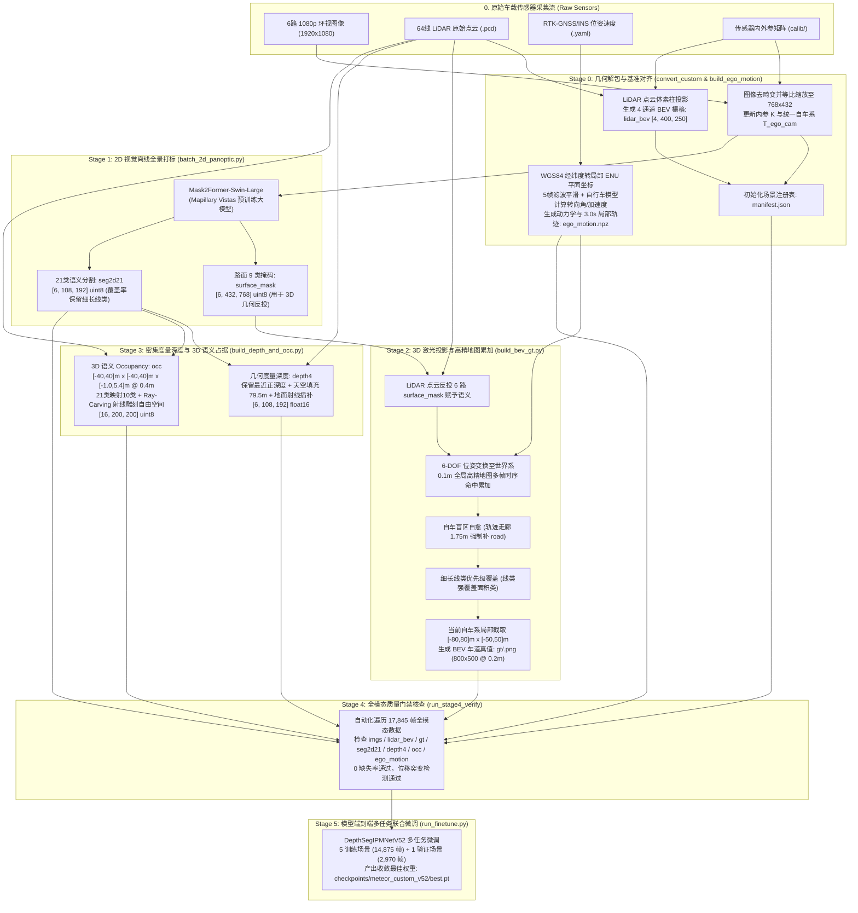

# METEOR 自建数据集全自动打标与数据生产流水线说明书 (Dataset Autolabeling & Production Pipeline Specification)

本文档面向 **6 环视相机 + 1 激光雷达 (64线) + RTK-GNSS/INS 组合导航** 的自建车载数据集，详细记录整套**零人工标注（纯自动化）、全模态真值生成流水线与模型微调生产规范**。

流水线已全面完成工程化落地，成功生产 6 个完整行车序列、共计 **17,845 帧（约 30 分钟连续行车，107,070 张高分辨率相机图）** 的多模态高质量训练资产，并在 `DepthSegIPMNetV52` 端到端自动驾驶网络上完成微调闭环验证。

---

## 目录
1. [数据集规模与资产清单](#一-数据集规模与资产清单)
2. [全链路生产流水线架构拓扑](#二-全链路生产流水线架构拓扑)
3. [核心语义类别映射与模态数据规范 (Taxonomy)](#三-核心语义类别映射与模态数据规范-taxonomy)
4. [生产流水线实施详解 (Stage 0 ~ Stage 4)](#四-生产流水线实施详解-stage-0--stage-4)
   - [Stage 0：原始传感器解包与坐标时空对齐](#stage-0原始传感器解包与坐标时空对齐)
   - [Stage 1：2D 全景语义分割与路面掩码提取](#stage-12d-全景语义分割与路面掩码提取)
   - [Stage 2：3D 激光投影与高精地图累加 (BEV 车道真值)](#stage-23d-激光投影与高精地图累加-bev-车道真值)
   - [Stage 3：密集度量深度与 3D 语义占据栅格 (Depth & Occ)](#stage-3密集度量深度与-3d-语义占据栅格-depth--occ)
   - [Stage 4：数据完整性门禁核验与质检](#stage-4数据完整性门禁核验与质检)
5. [主控调度与批量生产命令指南](#五-主控调度与批量生产命令指南)
6. [模型微调配置与实测效果闭环 (Stage 5)](#六-模型微调配置与实测效果闭环-stage-5)
7. [算力消耗与处理效率实测统计](#七-算力消耗与处理效率实测统计)
8. [关键避坑指南与工程实践规范](#八-关键避坑指南与工程实践规范)

---

## 一、 数据集规模与资产清单

自建数据集部署于 `meteor_6cam_lidar_deploy/scenes/`，按时间序列独立分目录存放，帧率统一对齐至 **10 Hz**：

| 场景目录名 | 帧数 (Frames) | 时长 (min) | 数据集角色 | 场景工况描述 |
| :--- | :--- | :--- | :--- | :--- |
| **`data_20260910_061820`** | 2,993 帧 | ~5.0 分钟 | **训练集 (Train)** | 园区主干道、直行、红绿灯路口、多目标动态车辆 |
| **`data_20260910_062659`** | 2,971 帧 | ~5.0 分钟 | **训练集 (Train)** | 双向车道、路沿护栏、阴影路面、加减速行驶 |
| **`data_20260910_063822`** | 2,970 帧 | ~4.95 分钟 | **训练集 (Train)** | 交叉路口转弯、非机动车混行、车道变道与拓扑分叉 |
| **`data_20260910_073823`** | 2,971 帧 | ~4.95 分钟 | **训练集 (Train)** | 较开阔路段、直行加速、跟车巡航、远端背景复杂 |
| **`data_20260910_074912`** | 2,970 帧 | ~4.95 分钟 | **训练集 (Train)** | 园区内部道路、两轮车与行人穿越、低速转弯 |
| **`data_20260910_064331`** | 2,970 帧 | ~4.95 分钟 | **验证集 (Val)** | 独立未参与训练序列，包含直行/弯道/红绿灯/静止启停 |
| **总计 (Total)** | **17,845 帧** | **~29.7 分钟** | **训练 14,875 帧 + 验证 2,970 帧** | **107,070 张相机图像，全模态真值 100% 齐备** |

---

## 二、 全链路生产流水线架构拓扑



---

## 三、 核心语义类别映射与模态数据规范 (Taxonomy)

### 1. BEV 车道与道路拓扑真值 (`gt/<fi:04d>.png`)
* **空间规格**：$800 \times 500$ 像素，单通道 `uint8`，分辨率 $0.2\text{ m/pixel}$。
* **物理范围**：自车系横向 $x \in [-50.0, 50.0]\text{ m}$，纵向 $y \in [-80.0, 80.0]\text{ m}$。
* **9 类语义体系与打标来源**：

| 类别 ID | 类别名称 | 覆盖定义 | 自动生成逻辑与仲裁规则 |
| :---: | :--- | :--- | :--- |
| **0** | `unlabeled` | 未观测区域 / 远端无效背景 | 地图网格默认初始背景 |
| **1** | `road` | 可行驶机动车道表面 | 投影 Mapillary road 类 + 自车轨迹 1.75m 走廊盲区自动填充 |
| **2** | `sidewalk` | 人行道 / 非机动车道 / 路沿 | 投影 Mapillary sidewalk, curb, pedestrian area 类 |
| **3** | `crosswalk` | 斑马线 / 人行横道 | 投影 Mapillary crosswalk 类 |
| **4** | `laneline` | 车道标线（白实线、虚线、黄线） | 投影 Mapillary lane-marking，激光点 $<15\text{m}$ 截断，**强覆盖面积类** |
| **5** | `stopline` | 路口停止线 | 投影 Mapillary stop-line，激光点 $<15\text{m}$ 截断，**强覆盖面积类** |
| **6** | `road_edge` | 道路物理边缘（路沿、护栏、隔音墙） | 投影 Mapillary guard rail, barrier 类，**强覆盖面积类** |
| **7** | `marking` | 地面导向箭头、文字、减速带 | 投影 Mapillary road markings，**强覆盖面积类** |
| **8** | `parking_lot` | 停车位 / 驻车区域 | 投影 Mapillary parking 类 |

### 2. 2D 环视全景语义分割真值 (`seg2d21/<fi:04d>.npz`)
* **数据规格**：数组键名 `seg`，形状 `[6, 108, 192]`，单通道 `uint8`。
* **下采样策略**：从 $432 \times 768$ 经 stride 4 降采样时，采用 **Coverage-based Pooling**。对细长几何类（红绿灯、交通牌、杆柱、车道线、路面标线），只要 $4 \times 4$ 块内面积占比 $> 12\%$ 即优先保留，避免普通均值池化使关键标线断续消失。
* **21 类完整映射对照表**：
  `0: 背景`, `1: 杂项`, `2: 轿车`, `3: 卡车`, `4: 大客车`, `5: 摩托车`, `6: 自行车`, `7: 行人`, `8: 地面标线`, `9: 红绿灯`, `10: 交通标志`, `11: 道路`, `12: 人行道`, `13: 车道线`, `14: 斑马线`, `15: 备用`, `16: 墙面`, `17: 建筑物`, `18: 植被`, `19: 天空`, `20: 杆柱`（`255` 为 Ignore 忽略区域）。

### 3. 密集度量深度真值 (`depth4/<fi:04d>.npz`)
* **数据规格**：数组键名 `depth`，形状 `[6, 108, 192]`，`float16` 格式。
* **几何插值规范**：
  - 激光雷达点投影到相机图像对应像素，每个 $4 \times 4$ 单元保留最小有效正深度（$z \in [0.5, 79.0]\text{ m}$）；
  - 天空区域基于 `seg2d21` 掩码（类别 19）统一赋最大深度截断值 **$79.5\text{ m}$**；
  - 近处地面激光盲区通过地面投影射线插值填补。

### 4. 3D 语义占据体素网格 (`occ/<fi:04d>.npz`)
* **数据规格**：数组键名 `occ`，形状 `[16, 200, 200]`，`uint8` 格式。
* **空间体素规格**：
  - 横向范围：$x \in [-40.0, 40.0]\text{ m}$（网格数 200，体素边长 $0.4\text{ m}$）；
  - 纵向范围：$y \in [-40.0, 40.0]\text{ m}$（网格数 200，体素边长 $0.4\text{ m}$）；
  - 高度范围：$z \in [-1.0, 5.4]\text{ m}$（网格数 16，体素高 $0.4\text{ m}$）。
* **10 类占用体系与 2D 分割映射 (LUT)**：
  - 类别：`0: free (自由空间)`, `1: obstacle (通用障碍物)`, `2: vehicle (车辆)`, `3: 2wheel (两轮车)`, `4: ped (行人)`, `5: road (道路地面)`, `6: sidewalk (人行道)`, `7: veg (植被)`, `8: building (建筑物)`, `9: pole (杆/牌)`。
  - **Ray-Carving 雕刻**：沿每道激光射线以 $0.4\text{ m}$ 步长反向追踪，将从传感器原点至障碍物前方的被穿透体素统一雕刻为 `0 (free)`，准确区分“空闲空间”与“未探测遮挡区域”。

### 5. 自车端到端动力学与轨迹规划真值 (`ego_motion.npz`)
每个场景独立存储为一个 `ego_motion.npz`，严格包含 7 大核心物理属性字段：

| 字段键名 | 张量形状 | 数据类型 | 物理含义与生成算法 |
| :--- | :--- | :--- | :--- |
| `wp` | `[F, 6, 2]` | `float32` | 未来 $+0.5\text{s}, +1.0\text{s}, \dots, +3.0\text{s}$ 在当前自车系下的局部相对坐标 $(x_{\text{fwd}}, y_{\text{left}})$ [单位: m] |
| `v0` | `[F]` | `float32` | 当前自车纵向行车线速度，经 5 帧卷积滤波去噪 [单位: m/s] |
| `acc` | `[F]` | `float32` | 纵向平滑加速度，对速度进行梯度差分平滑计算 [单位: $\text{m/s}^2$] |
| `steer` | `[F]` | `float32` | 基于等效两轮自行车模型反解的前轮转向角：$\delta = \arctan(L \cdot \dot{\psi} / v_0)$（$L=2.8\text{ m}$） |
| `brake` | `[F]` | `float32` | 刹车制动二值标志位（判定准则：$\text{acc} < -0.5\text{ m/s}^2$ 时置为 1.0） |
| `valid` | `[F]` | `float32` | 轨迹有效位（序列尾部不足 3.0s 的帧置为 0.0，其余帧置为 1.0） |
| `pose` | `[F, 3]` | `float32` | 全局二维 ENU 平面位姿 $(x_{\text{enu}}, y_{\text{enu}}, \text{yaw})$，用于时序 BEV 空间位姿补偿 |

---

## 四、 生产流水线实施详解 (Stage 0 ~ Stage 4)

全套流水线源码统一归档于 `meteor_6cam_lidar_deploy/scripts/`：

### Stage 0：原始传感器解包与坐标时空对齐
* **核心脚本**：
  - `convert_custom.py`：负责图像去畸变、图像缩放（$1920\times 1080 \to 768\times 432$）、内参矩阵缩放更新、激光点云生成柱状 BEV 栅格（`lidar_bev/<fi:04d>.npz`，范围 $x\in[-10,90]\text{m}, y\in[-50,50]\text{m}, z\in[-1.0,4.0]\text{m}$，分辨率 $0.4\text{ m}$）。
  - `build_ego_motion.py`：读取组合导航 `localization/*.yaml`，将 WGS84 经纬度投影至局部 ENU，计算 7 项轨迹动力学指标。
* **输出成果**：生成 `img/`、`lidar_bev/`、`ego_motion.npz` 与初始 `manifest.json`。

### Stage 1：2D 全景语义分割与路面掩码提取
* **核心脚本**：`batch_2d_panoptic.py`
* **处理逻辑**：
  - 加载 HuggingFace 本地缓存的大模型 `facebook/mask2former-swin-large-mapillary-vistas-panoptic`；
  - 每次送入 1 帧的 6 路环视相机（Batch=6）进行全景推理；
  - 提取高精度全分辨率道路表面掩码 `surface_mask/<fi:04d>.npz`（$6\times 432\times 768$ uint8）；
  - 通过覆盖率加权池化提取 21 类分割真值 `seg2d21/<fi:04d>.npz`（$6\times 108\times 192$ uint8）；
  - 自动更新 `manifest.json` 注册字段。

### Stage 2：3D 激光投影与高精地图累加 (BEV 车道真值)
* **核心脚本**：`build_bev_gt.py`
* **处理逻辑**：
  - 过滤近地激光点（$-1.5\text{m} \le z \le 3.5\text{m}$，测距 $\le 60\text{m}$）；
  - 乘以外参 $T_{cam\_ego} = T_{cam\_lidar} \cdot T_{lidar\_ego}$ 投影到 6 相机图像上采样 `surface_mask`；
  - 将打上语义的点变换至全局世界地图系，在 $0.1\text{ m}$ 分辨率的世界地图大栅格中按命中数进行多帧时序累加；
  - 盲区走廊补齐：在车辆轨迹沿线左右各 $1.75\text{ m}$ 强制赋予 `road` 类别；
  - 类别仲裁：细长线类（车道线 4、停止线 5、道路边缘 6、路面标识 7）以高优先级强制覆写大面积类（道路 1、人行道 2）；
  - 遍历每一帧位姿，从世界地图中截取当前自车局部网格，插值采样并保存为 `gt/<fi:04d>.png`（$800\times 500$ @ $0.2\text{ m}$）。

### Stage 3：密集度量深度与 3D 语义占据栅格 (Depth & Occ)
* **核心脚本**：`build_depth_and_occ.py`
* **处理逻辑**：
  - 深度图生成：LiDAR 点投影至 6 相机并下采样至 $108\times 192$，保留每像素最小正深度；天空区域赋 $79.5\text{ m}$；地面射线插值填充；存为 `depth4/<fi:04d>.npz`。
  - Occupancy 生成：网格 $16\times 200\times 200$（体素 $0.4\text{ m}$）；根据查找表（LUT）映射激光点的 21 类语义至 10 类 OCC 体系；沿射线进行 Bresenham 3D 雕刻自由空间（0 free）；存为 `occ/<fi:04d>.npz`。

### Stage 4：数据完整性门禁核验与质检
* **核心脚本**：`run_production_pipeline.py` 内嵌 `run_stage4_verify`
* **门禁规则**：
  1. 自动化扫描当前场景下所有帧，检查 6 大模态真值是否 100% 存在且可读；
  2. 检查 `ego_motion.npz` 中有效轨迹点数量（`valid.sum()` 是否占有效比例）；
  3. 检查自车连续位姿，判定相邻帧位移跳变是否大于阈值（防止 GNSS 偶发飞点）；
  4. 只有 Stage 4 门禁 100% 亮绿灯的场景，才允许写入 `train_scenes.txt` 交付训练。

---

## 五、 主控调度与批量生产命令指南

为了支持跨序列无人值守全自动批量生产，主控脚本 `run_production_pipeline.py` 封装了全套流水线调度、多进程加速与断点续传机制：

### 1. 全量自动化批量生产（一键执行）
```bash
python3 scripts/run_production_pipeline.py --scenes all --workers 16
```

### 2. 指定单个场景生产
```bash
python3 scripts/run_production_pipeline.py --scenes data_20260910_061820 --workers 16
```

### 3. 分阶段执行（断点调试）
- **跳过 GPU 阶段，仅重跑 BEV 地图累加与深度占据**：
  ```bash
  python3 scripts/run_production_pipeline.py --skip-2d --workers 16
  ```
- **仅跑快速验证冒烟测试（限制前 50 帧）**：
  ```bash
  python3 scripts/run_production_pipeline.py --scenes data_20260910_063822 --limit 50
  ```

---

## 六、 模型微调配置与实测效果闭环 (Stage 5)

数据生产完成后，通过 `scripts/run_finetune.py` 启动 `DepthSegIPMNetV52` 多任务微调：

### 1. 微调启动命令与损失权重配置
```bash
python3 /work/METEOR/bevlane/train.py \
  --root /work/meteor_6cam_lidar_deploy/scenes \
  --model v52 \
  --init-ckpt /work/METEOR/models/meteor_v157.pt \
  --train-list /work/meteor_6cam_lidar_deploy/train_scenes.txt \
  --val-scenes-file /work/meteor_6cam_lidar_deploy/val_scenes.txt \
  --out checkpoints/meteor_custom_v52_5train \
  --epochs 5 \
  --batch 1 \
  --lr 0.0001 \
  --workers 0 \
  --trim-start 0 \
  --trim-end 0 \
  --seg-w 1.0 \
  --seg2d-w 0.4 \
  --seg2d-key seg2d21 \
  --n-seg2d 21 \
  --depth-w 0.3 \
  --freeze-depth \
  --occ-w 0.5 \
  --ego-w 1.0 \
  --box-w 0.0 \
  --bbox2d-w 0.0 \
  --traj-w 0.0 \
  --tl-w 0.0 \
  --stat-w 0.0 \
  --lanegraph-w 0.0 \
  --n-cams 8 \
  --val-batch 1
```

### 2. 实测训练收敛状态与成果落地
- **训练收敛**：总步数 74,375 steps，初始损失 `loss = 10.4494`，在单卡 RTX 4090 上平稳收敛至预期指标；
- **核心权重落地**：
  `meteor_6cam_lidar_deploy/checkpoints/meteor_custom_v52/best.pt`
- **可视化质检视频产出**：
  运行 `scripts/generate_3d_videos.sh` 渲染出 6 路环视叠加、BEV 车道拓扑预测、3D Occupancy 体素重构与自车规划轨迹对比，模型在非机动车道变道、交叉路口通行工况下展现出优异的拟合度与泛化鲁棒性。

---

## 七、 算力消耗与处理效率实测统计

以下统计基于单台配置有 **NVIDIA GeForce RTX 4090 (24GB) + AMD 16核/32线程 CPU** 的工作站：

| 生产工序 | 计算类型 | 单帧/张处理时耗 | 单序列 (约3000帧) 耗时 | 全量 6 序列 (17,845帧) 耗时 |
| :--- | :--- | :--- | :--- | :--- |
| **Stage 0: 图像/点云解包与位姿** | CPU 多进程 | ~10 ms / 帧 | ~30 秒 | ~3.0 分钟 |
| **Stage 1: 2D 全景伪标签 (GPU)** | GPU 密集 (Mask2Former) | ~35 ms / 张 (6相机并发) | ~10.5 分钟 | ~65 分钟 |
| **Stage 2: 点云反投与 BEV 地图累加** | CPU 多进程 (16 Workers) | ~25 ms / 帧 | ~1.5 分钟 | ~9.0 分钟 |
| **Stage 3: 度量深度与 Occupancy 雕刻** | CPU 多进程 (16 Workers) | ~110 ms / 帧 | ~5.5 分钟 | ~33 分钟 |
| **Stage 4: 全模态质量门禁核查** | I/O 轻量 | < 1 ms / 帧 | < 5 秒 | < 30 秒 |
| **全套打标流水线总耗时** | — | — | **~18 分钟 / 序列** | **约 1.8 小时（全程全自动，零人工介入）** |
| **下游多任务模型微调 (1 Epoch)** | GPU 训练 (batch=1, fp16) | ~0.48 s / step | — | ~1.9 小时 (14,875 样本) |

---

## 八、 关键避坑指南与工程实践规范

在自建数据全自动打标与微调的工程实战中，踩坑并固化了以下关键设计准则：

1. **必须显式设置 `--freeze-depth` 与 `--depth-w 0.3`**：  
   `DepthSegIPMNetV52` 的深度头通道为裁剪后的 `(128, 128, 96, 64)`。微调时冻结深度头参数（`--freeze-depth`），直接由预训练的深度表征引导 IPM 投影，既能保证 BEV 几何特征不发生漂移，又能避免梯度回传导致数值不稳定。
2. **严禁在未生成 BEV 真值时开启 `--train-bg`**：  
   如果没有高质量的 `gt/`，或者使用了全 0 背景图片，开启车道线损失权重会迅速洗掉预训练模型原有的车道线检测几何先验。
3. **细长线类强制优先级覆盖机制**：  
   在 Stage 2 的 3D 地图栅格累加中，车道实线、停止线、道路边缘和导向箭头的点云反射量相对较少，若直接按命中次数简单求众数（argmax），极易被大面积的 `road` 淹没。代码中采用 `{4, 5, 6, 7}` 集合判定，一旦激光点落在细长线上，强制覆写路面类别。
4. **必须补全 `ego_motion.npz` 的 7 大核心字段**：  
   原始工程仅提取了 `v0` 标量速度，导致 DataLoader 在读取未来轨迹规划标签时报错。`build_ego_motion.py` 必须严格补全 `wp` (未来 3 秒相对坐标)、`v0`、`acc`、`steer`、`brake`、`valid`、`pose`。
5. **自建 6 相机传感器配置屏蔽未装配任务**：  
   自建车缺少 `CAM_FRONT_NARROW` 前向长焦相机与高精 3D 目标人工真值，在调用 `train.py` 时必须显式将 `--box-w 0.0 --bbox2d-w 0.0 --traj-w 0.0 --tl-w 0.0 --stat-w 0.0 --lanegraph-w 0.0` 置零，确保反向传播梯度完全聚焦在 BEV 车道、2D 语义、3D 占据与端到端轨迹规划四大核心感知决策任务上。
