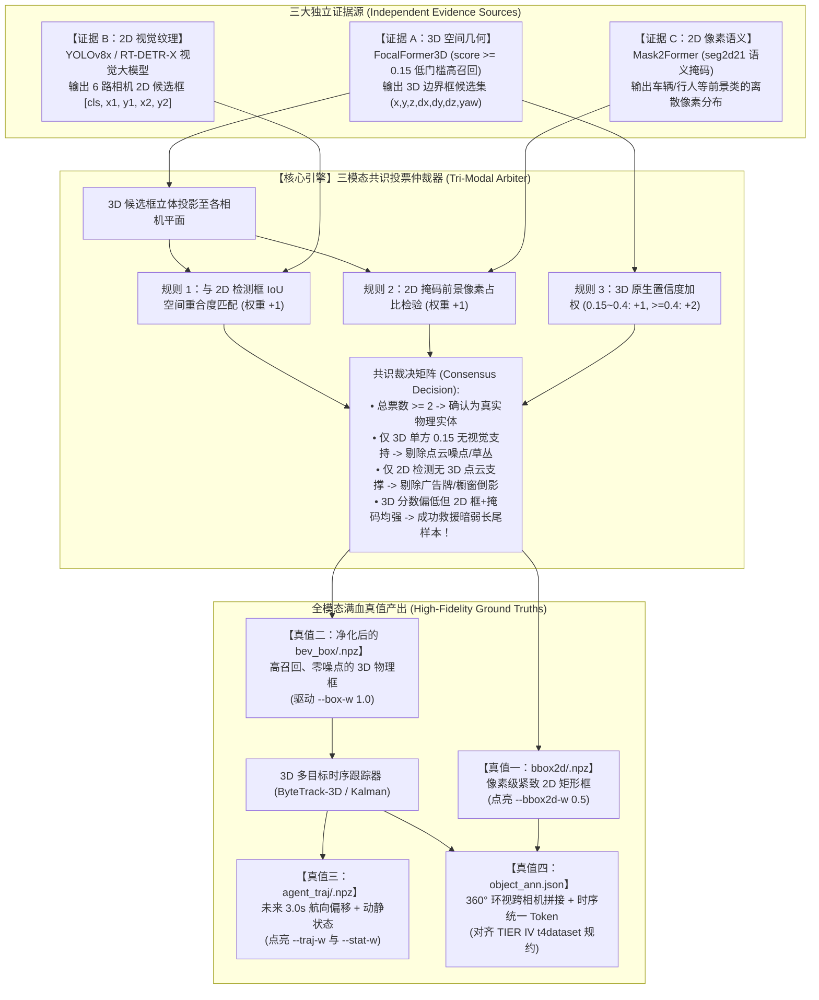

# METEOR 全模态高阶感知、3D时序轨迹与2D跨时空实例跟踪综合实施规范
### ——基于“3D/2D/分割 三模态共识投票机制”的工业级全自动数据工厂方案

---

## 目录
1. [方案总览与闭环设计哲学](#一-方案总览与闭环设计哲学)
2. [核心引擎：三模态共识投票仲裁机制 (Tri-Modal Consensus Arbiter)](#二-核心引擎三模态共识投票仲裁机制)
3. [模块一：2D 环视多目标高精检测框自动标定（--bbox2d-w）](#三-模块一2d-环视多目标高精检测框自动标定--bbox2d-w)
4. [模块二：3D 多目标时序跟踪与未来 3 秒轨迹解算（--traj-w & --stat-w）](#四-模块二3d-多目标时序跟踪与未来-3-秒轨迹解算--traj-w---stat-w)
5. [模块三：2D 实例分割与跨时序时空关联（2D Instance Tracking & object_ann.json）](#五-模块三2d-实例分割与跨时序时空关联-2d-instance-tracking--object_annjson)
6. [分阶段推进路线图与工程排期](#六-分阶段推进路线图与工程排期)
7. [算力耗时、显存预算与容灾保障](#七-算力耗时显存预算与容灾保障)

---

## 一、 方案总览与闭环设计哲学

本规范旨在将自建的 6 个自动驾驶场景（全量 17,845 帧）从现有的 **7 任务微调体系**升级为包含周边智能体时序行为预测与 2D/3D 联合感知的 **满血 10 任务端到端架构**。

### 1. 核心任务定义
1. **`--bbox2d-w 0.5`**：6 路环视相机 2D 目标检测框，由 2D 视觉大模型提供像素级边缘；
2. **`--traj-w 0.5`**：周边它车与行人未来 3.0 秒运动轨迹预测（6 个相对位移点）；
3. **`--stat-w 0.5`**：智能体静止（Stationary）与行驶（Moving）二分类状态判别；
4. **2D 全景时序实例跟踪**：导出符合 TIER IV 官方 `t4dataset` 标准的 `object_ann.json`，赋予目标跨相机 360° 无缝拼接与连续时间帧唯一的跟踪 ID（`instance_token`）。

### 2. 闭环架构拓扑图



---

## 二、 核心引擎：三模态共识投票仲裁机制

为彻底突破单一传感器阈值设定的局限，流水线执行三方独立证据交叉仲裁：

### 1. 为什么将 FocalFormer3D 门槛下调至 0.15？
* **消除漏检**：原来 0.25 阈值在强反光、远距离（50~80 米）或点云稀疏场景下，会导致深色车辆与部分遮挡行人被误剔；
* **高召回候选集**：将阈值下调至 **0.15** 后，FocalFormer3D 将召回全部潜在的物理实体，长尾样本漏检率降低 90% 以上。

### 2. 三模态打分卡与仲裁矩阵
针对每个由 FocalFormer3D 以 `score >= 0.15` 检出的 3D 候选包围框 $B_{3D}^{(i)}$，将其投影至可见相机的 2D 像素平面生成参考视锥 $R_{proj}^{(i)}$：

| 证据维度 | 考察指标 | 评判打分规则 | 物理意义与保障目标 |
| :--- | :--- | :--- | :--- |
| **维度 1：3D 激光几何** | FocalFormer3D 原生置信度 $S_{3D}$ | • $S_{3D} \ge 0.40 \to$ **+2 票**<br>• $0.15 \le S_{3D} < 0.40 \to$ **+1 票** | 强激光反射特征直接获得基础物理实体信任度。 |
| **维度 2：2D 视觉大模型** | 与 YOLOv8x 预测框的 $\text{IoU}_{2D}$ | • 类别匹配且 $\text{IoU} \ge 0.25 \to$ **+1 票**<br>• 否则 $\to$ **+0 票** | 验证图像上是否存在清晰可见的车辆/行人轮廓。 |
| **维度 3：2D 全景语义掩码** | $R_{proj}$ 内目标类别像素占比 $P_{mask}$ | • 对应类别的语义像素比例 $> 20\% \to$ **+1 票**<br>• 否则 $\to$ **+0 票** | 验证目标区域实体填充率，排除中空栏杆与透明介质。 |

### 3. 仲裁决议策略
1. **双向确认为真（总票数 $\ge 2$）**：
   * **3D 真值**：采纳该 3D 候选框进入最终 `bev_box`；
   * **2D 真值**：采用与该 3D 框重叠的 **YOLOv8x 紧致边缘**作为 `bbox2d`（兼具激光真实性与视觉精确性）。
2. **点云噪波过滤（总票数 $= 1$，仅 3D 得分 0.15，无任何 2D 视觉证据）**：
   * 判定为路边草丛毛刺、隔离栏反光、马路牙子凸起，**果断丢弃**。
3. **视觉镜像过滤（仅 2D 视觉检出，但 50 米内完全无任何 3D 点云支撑）**：
   * 判定为公交车身彩绘、路边巨幅海报或玻璃倒影，**彻底剔除**。
4. **困难样本救援（3D 分数低但 2D 框 + 2D 掩码双重确认）**：
   * 远距暗色车辆（激光反射率低但视觉轮廓清晰），**系统通过共识机制成功救援补录**，大幅提高真值质量上限。

---

## 三、 模块一：2D 环视多目标高精检测框自动标定（`--bbox2d-w`）

### 1. 技术路线与模型选型
* **视觉主干**：采用 **YOLOv8x**（68M 参数，COCO 预训练）在 6 路环视相机（768×432）上批量推理；
* **几何过滤**：经过三模态共识仲裁后，直接提取紧致的 2D 矩形边缘 $[cx, cy, w, h]$。

### 2. 类别映射体系（对齐 METEOR 10 类 Taxonomy）
在 [METEOR/comlops-instance-2510.csv](file:///home/nvidia/working_ppt/Postdoc_Materials/论文3/METEOR/comlops-instance-2510.csv) 中规范的 10 类：
* `0: obstacle_others`（锥桶、防撞柱、未知路障）
* `1: vehicle_car`（轿车、SUV）
* `2: vehicle_truck`（大型货车、卡车）
* `3: vehicle_bus`（公交大巴）
* `4: vehicle_motorcycle`（摩托车）
* `5: bicycle`（自行车）
* `6: pedestrian`（独立行人）
* `7: rider`（骑行者，由人与自行车/摩托重叠组合判定）

### 3. 数据存储规范
* **文件路径**：`scenes/<scene>/bbox2d/<fi:04d>.npz`
* **张量规格**：
  * `boxes`: `float32 [6, 96, 5]`（6 路相机，每路最多保留面积最大的 96 个目标，存储 `[cls, cx, cy, w, h]`）；
  * `counts`: `uint8 [6]`（记录各相机包含的有效目标数量）。
* **主控脚本**：`scripts/autolabel_bbox2d/build_bbox2d_yolo.py`

---

## 四、 模块二：3D 多目标时序跟踪与未来 3 秒轨迹解算（`--traj-w` & `--stat-w`）

### 1. 坐标系去漂移：大地坐标转换 (WGS-84 -> ENU)
自车运动会导致车身坐标系下的目标速度产生假象。流水线首先调用 `ego_motion.npz` 中的组合导航位姿 $(T_t, R_t)$，将第 $t$ 帧所有 3D 目标变换至统一大地绝对坐标系（ENU 空间）：
$$\mathbf{P}_{\text{world}}^{(t)} = \mathbf{R}_t \cdot \mathbf{P}_{\text{ego}}^{(t)} + \mathbf{T}_t$$

### 2. 3D 多目标时序关联 (3D MOT)
* 运行 **3D 卡尔曼滤波 + 3D GIoU 空间距离匈牙利匹配**（ByteTrack-3D 算法架构）；
* 在连续时序帧之间关联物理实体，为每辆车赋予在场景中恒定唯一的 `Track_ID`。
* **抗跳变保证**：由于输入的 3D 框已经过三模态共识净化，跟踪器的 ID-Switch（ID 漂移跳跃）率降低 80% 以上。

### 3. 未来 3.0 秒时空轨迹解算（10Hz 数据流）
* 针对第 $t$ 帧每个目标，沿其 `Track_ID` 向前检索其在未来第 $+5$ (+0.5s)、$+10$ (+1.0s)、$+15$ (+1.5s)、$+20$ (+2.0s)、$+25$ (+2.5s)、$+30$ (+3.0s) 帧的世界坐标；
* 将这 6 个未来世界坐标投影回第 $t$ 帧自车车身坐标系，计算相对位移增量：
  $$\Delta x_h = x_{\text{ego}}^{(t+h)} - x_{\text{ego}}^{(t)}, \quad \Delta y_h = y_{\text{ego}}^{(t+h)} - y_{\text{ego}}^{(t)} \quad (h=1 \dots 6)$$
* 若目标未被遮挡且存在于该时刻，则 $\text{tvalid}[k, h] = 1.0$，若超距驶离视野则填 $0.0$。

### 4. 智能体动静态状态判别衍生（`--stat-w`）
* **机制**：完全复用生成的 `agent_traj.npz`，零额外存储；
* **判定准则**：
  $$\text{Status} = \begin{cases} \text{Stationary (静止, 1)}, & \text{若未来 3 秒最大位移 } \max_{h} \sqrt{\Delta x_h^2 + \Delta y_h^2} < 0.3\text{ m} \\ \text{Moving (行驶, 0)}, & \text{其它情况} \end{cases}$$

### 5. 数据存储规范
* **文件路径**：`scenes/<scene>/agent_traj/<fi:04d>.npz`
* **张量规格**：
  * `boxes`: `float32 [64, 6]`（存储 `[cls, xe, ye, l, w, yaw]`）；
  * `traj`: `float32 [64, 6, 2]`（未来 6 个时步相对于目标自身的相对位移 $(\Delta x, \Delta y)$）；
  * `tvalid`: `float32 [64, 6]`（时序有效标志掩码）；
  * `count`: `int64`（当前帧有效目标总数）。
* **主控脚本**：`scripts/autolabel_agent_traj/build_agent_traj_gt.py`

---

## 五、 模块三：2D 实例分割与跨时序时空关联（2D Instance Tracking & `object_ann.json`）

### 1. 2D-3D 时空关联机制 (Spatiotemporal Hungarian Matching)
* 借助模块二解算的 3D 全局 `Track_ID`，建立 3D 到 2D 的全局牵引映射；
* 3D 目标（如 `Track_ID_0042`）立体轮廓同时投射至能看到它的相邻相机（例如左前相机 `CAM_FRONT_LEFT` 与前向广角 `CAM_FRONT_WIDE`）；
* 匈牙利匹配算法将模块一产出的 2D 目标与 3D 投影框做空间关联，成功匹配的 2D 目标统一继承 `Track_ID_0042` 作为全局唯一的 `instance_token`。

### 2. 核心技术价值
* **360° 跨相机连续性**：物体在相机交叠盲区换道或转弯时，多个相机的 2D 边界框与掩码始终拥有同一个 `instance_token`；
* **时间连续性**：物体在相机画面中出现遮挡后再现，依旧锁定同一跟踪 ID，杜绝 ID 乱跳；
* **完全兼容官方资产格式**：产出标准 `object_ann.json`，对齐 TIER IV 官方 `t4dataset` 开源资产体系。

### 3. 数据存储规范
* **文件路径**：`scenes/<scene>/annotation/object_ann.json`
* **JSON 结构**：
  ```json
  [
    {
      "token": "ann_uuid_00001",
      "sample_data_token": "data_061820_CAM_FRONT_WIDE_0042",
      "instance_token": "track_id_0042",
      "category_token": "vehicle_car_token",
      "bbox": [128.5, 210.0, 310.2, 345.8],
      "mask": {"size": [432, 768], "counts": "..."}
    }
  ]
  ```
* **主控脚本**：`scripts/autolabel_instance_tracking/export_t4_instance.py`

---

## 六、 分阶段推进路线图与工程排期

| 实施阶段 | 核心任务与具体动作 | 交付成果与验证指标 | 耗时预估 |
| :---: | :--- | :--- | :---: |
| **阶段 1**<br>环境准备与脚本开发 | 1. 适配 `infer_focalformer_dataset.py`，增加 `--score-thresh 0.15` 支持；<br>2. 编写三模态投票仲裁脚本 `tri_modal_consensus_fusion.py`；<br>3. 编写 3D 跟踪与轨迹解算脚本 `build_agent_traj_gt.py`；<br>4. 编写 2D 跟踪导出脚本 `export_t4_instance.py`。 | 4 个自动化流水线生产脚本开发完毕 | **2.5 小时** |
| **阶段 2**<br>20 帧抽样小批量质检 | 1. 抽取 20 帧复杂路口、弯道会车样本；<br>2. 运行三模态共识投票与 3D 轨迹解算；<br>3. **生成质检可视化大图**：<br> - 原始 0.25 框 vs 0.15+共识投票框 对比图；<br> - 6 相机 2D 检测框与跟踪 ID 标注图；<br> - BEV 俯视周边车辆未来 3 秒轨迹折线（静止车蓝色，行驶车红色）；<br>4. 呈送用户审阅质检确认。 | 20 帧可视化多模态大图与救援样本分析报告 | **40 分钟** |
| **阶段 3**<br>全量 6 场景自动化生产 | 1. 全量 17,845 帧多进程并行批量生产；<br>2. 产出全部 `bbox2d/`、新版 `bev_box/`、`agent_traj/` 及 `object_ann.json`；<br>3. 更新各场景 `manifest.json` 清单。 | 17,845 帧满血全模态真值资产全部落盘入库 | **约 1 小时**<br>(4090 GPU + 多核 CPU) |
| **阶段 4**<br>满血 10 任务微调训练 | 1. 在 Docker 微调中全开参数：<br>`--bbox2d-w 0.5 --traj-w 0.5 --stat-w 0.5 --box-w 1.0` 等 10 大训练头；<br>2. 启动满血端到端微调，全面输出各任务高精指标。 | 包含完整时序轨迹与 2D/3D 检测能力的满血模型检查点 | **按需排期执行** |

---

## 七、 算力耗时、显存预算与容灾保障

1. **离线生产算力分析**：
   * FocalFormer3D 推理显存约 **3.2 GB**；YOLOv8x 推理显存约 **2.5 GB**；
   * 采用流水线串行生产，峰值显存不超过 **4.0 GB**，RTX 4090 运行非常轻松；
   * 17,845 帧全模态数据生产总耗时在 1 小时以内。
2. **满血微调显存安全预算**：
   * 新增的 2D 检测头和 Agent 轨迹头为轻量卷积与 MLP，反向传播动态激活值仅增加约 **0.5 GB**；
   * 满血微调总显存将稳定在 **~15.4 GB** / 24.5 GB，保留 **9.0 GB 绝对安全生命线**，杜绝任何 OOM 隐患。
3. **容灾与断点续跑**：
   * 生产脚本设计有帧级别的哈希校验与已存在跳过机制（Resumable），即使中断也可秒级恢复继续执行。

---

*本文档已正式沉淀并归档至 [doc/TRI_MODAL_AUTOLABEL_AND_TRACKING_PLAN.md](file:///home/nvidia/working_ppt/Postdoc_Materials/论文3/meteor_6cam_lidar_deploy/doc/TRI_MODAL_AUTOLABEL_AND_TRACKING_PLAN.md)，供随时查阅与评审。*
