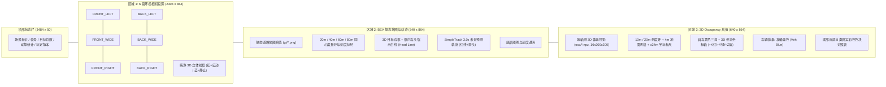
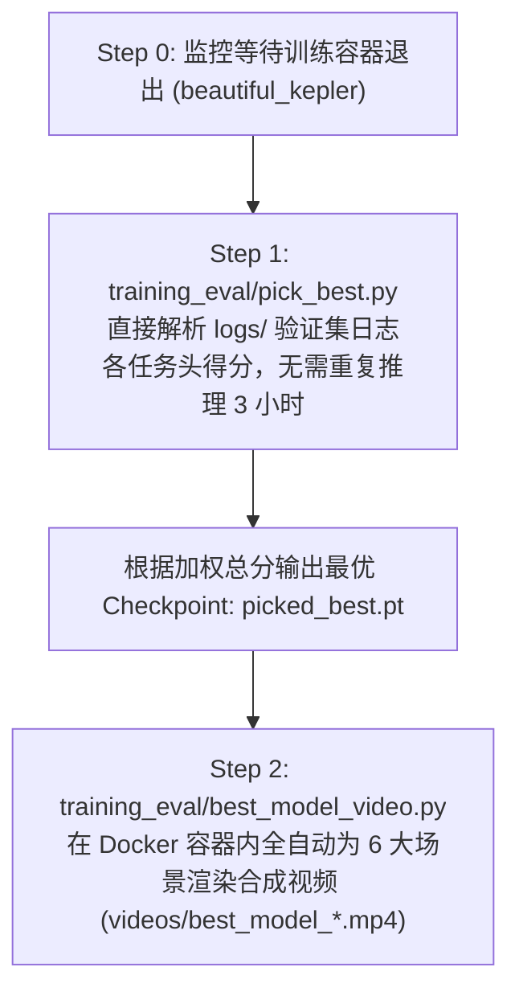

# 自动标注与生产流水线脚本索引 (Scripts Directory Guide)

> **更新时间**：2026年 09月 24日  
> **适用系统**：METEOR 6 相机 + 1 激光雷达多模态端到端自动驾驶系统（6 场景，17,845 帧）  
> **涵盖能力**：数据自动标注（BEV/3D Box/2D Box/轨迹/OCC/深度/红绿灯）、外参标定更新适配、全模态质检看板、模型训练微调、验证日志解析选优与全场景视频评测。

---

## 🌟 核心入口总览 (Master Entrypoints)

| 入口脚本 | 类型 | 适用场景与核心职责 |
|---|---|---|
| **[`render_gt_comprehensive_dashboard.py`](render_gt_comprehensive_dashboard.py)** | 🌟 **全模态质检** | **全模态真值综合质检看板生成**：6 环视 3D 框投影（红动蓝静）+ BEV 20/40/60/80m 刻度环 + 框内车头指示白线 + 3.0s 轨迹 + 3D OCC 等轴测刻度（10/20m 环、4m 网格、±24m 标尺、自车三轴、蓝色车辆体素校验） |
| **[`run_phase3_full_production.sh`](run_phase3_full_production.sh)** | 🌟 **主线生产** | **Phase-3 主线全流程**：6 场景 17,845 帧四步串行（FocalFormer3D 推理 → 三模态共识融合 → SimpleTrack 3D 追踪与 3.0s 轨迹 → T4 实例追踪导出） |
| **[`run_production_pipeline.py`](run_production_pipeline.py)** | 🌟 **工序总控** | **多工序全流程总控**：2D 全景分割（Mask2Former）→ 点云位姿累加与 BEV 地图生成 → 稠密深度与 10 类 OCC 占用栅格 → 3D 框验证 |
| **[`post_train_pipeline.sh`](post_train_pipeline.sh)** | 🌟 **训练后推优** | **训练后全自动推优与视频生成**：监控微调容器退出 → 解析全量验证日志各头表现选优（`pick_best.py`）→ 针对最佳 Checkpoint 批量生成全场景推理视频（`best_model_video.py`） |
| **[`train_meteor_full_5ep.sh`](train_meteor_full_5ep.sh)** | ⚠️ **训练脚本** | 5-epoch 基础训练启动脚本参考（建议配合文末最新 10 头权重配置与 `--resume/--val-full` 运行） |

---

## 📂 脚本目录架构 (Directory Architecture)

```text
scripts/
├── README.md                                  # 📖 本说明文件
├── render_gt_comprehensive_dashboard.py      # 🌟 全模态真值综合质检看板渲染总控 (3484x914)
├── run_phase3_full_production.sh              # 🌟 Phase-3 主线: 6 场景四步全流程 (推理→融合→追踪→导出)
├── run_production_pipeline.py                 # 🌟 全自动一键多工序生产总控 (Stage 1~4 全流水线)
├── post_train_pipeline.sh                     # 🌟 训练后全自动推优与视频生成流水线 (wait→pick→render)
├── train_meteor_full_5ep.sh                   # ⚠️ 历史 5-epoch 训练启动脚本参考
│
├── autolabel_ego_motion/                      # 🧭 【自车运动】数据转换与位姿平滑
│   ├── convert_custom.py                      # 原始 6 相机 + LiDAR 时间戳对齐、manifest 资产清单
│   └── build_ego_motion.py                    # WGS-84 RTK → ENU、位姿平滑、3.0s 未来航向点位姿解算
│
├── autolabel_3d_box/                          # 🚗 【3D 检测框】点云模型推理与清洗
│   ├── infer_focalformer_dataset.py           # FocalFormer3D-LC 全量推理 + 右手系转换 + 自车框过滤
│   ├── build_3d_box_gt.py                     # (旧路线) 5 帧位姿补偿点云融合 + 6 相机多视反投影过滤
│   ├── prune_ego_boxes.py                     # 自车误检二次清理 (is_ego_vehicle_box 批处理)
│   ├── compare_focalformer_centerpoint.py     # FocalFormer3D vs CenterPoint 对比评测
│   ├── bev_box_visualizer.py                  # 6 路环视 3D 线框投影 + BEV 栅格渲染抽检
│   └── watch_and_push.sh                      # ⚠️ 一次性 watcher (监控推理完成并推送到远程)
│
├── autolabel_bbox2d/                          # 🎯 【2D 目标框】三模态共识融合
│   ├── tri_modal_consensus_fusion.py          # FocalFormer3D + YOLOv8x + Mask2Former 三模态投票与 3D 净化
│   └── compare_baseline_vs_consensus.py       # 基线 0.25 vs 共识 0.15 定量统计与质检对比
│
├── autolabel_agent_traj/                      # 🛤️ 【3D MOT 与轨迹】SimpleTrack 与未来预测
│   ├── simpletrack_mot.py                     # SimpleTrack (ICRA 2022) 核心追踪器模块接入
│   ├── build_agent_traj_simpletrack.py         # ✅ 当前引擎: 输出格式兼容 + 注入全局 track_ids
│   ├── refine_and_filter_agent_traj.py        # 🌟 轨迹异常过滤、超速跳变修复、180°航向回正与 3s<1m 静止零速锚定 (ZUPT)
│   ├── build_agent_traj_gt.py                 # (旧引擎) 自研恒速外推 + L2 距离关联追踪器
│   ├── compare_mot_trackers.py                # SimpleTrack vs 旧自研引擎性能全方位指标评测
│   └── visualize_agent_traj.py                # 2D 框 + 3D 框 + 未来 3.0s 轨迹多模态可视化
│
├── autolabel_instance_tracking/               # 🧩 【实例追踪】T4 格式导出
│   └── export_t4_instance.py                  # 3D 框多视投影与 2D 检测框 IoU 关联, 导出 T4 标准格式
│
├── autolabel_traffic_light/                   # 🚦 【交通灯】红绿灯状态识别
│   └── build_tl_gt.py                         # 6 相机 ROI 提取、时序跟踪、HSV 色彩空间投票
│
├── autolabel_semantic_occ/                    # 🌐 【语义与 OCC】BEV 车道地图、深度与 3D 体素
│   ├── batch_2d_panoptic.py                   # Mask2Former 2D 全景语义掩码批量推理
│   ├── test_2d_panoptic.py                    # 2D 全景分割模型选型与评测
│   ├── build_bev_gt.py                        # 点云时序累加 + 地面滤波 + BEV 9 类车道地图 GT
│   ├── build_depth_and_occ.py                 # 10 类语义 3D Occupancy + 稠密深度 (depth4)
│   ├── regen_depth4.py                        # 🌟 最新 XCalib 精细外参点云重投影与深度重生成(含自车点过滤)
│   ├── check_depth4_gt.py                       # depth4 GT 质检:LiDAR 重投影对比,MAE/bias 分距离段 + 4 面板可视化
│   ├── promote_solid_crosswalk.py             # 人行横道实心化连续性提升算法 (17,845 帧)
│   ├── generate_crosswalk_test_vis.py         # 人行横道微调前后对比测试可视化
│   ├── occ_visualizer.py                      # 3D 线框 + 10 类 OCC 俯视可视化
│   └── diag_occ.py                            # OCC 路面体素 vs LiDAR 地面点重合度与外参诊断
│
└── training_eval/                             # 🚀 【微调与评测】模型训练、推优与视频渲染
    ├── run_finetune.py                        # 微调启动器 (单卡/多卡, 10 头任务损失权重灵活配置)
    ├── pick_best.py                           # 🌟 验证日志多指标解析推选最优 Checkpoint (picked_best.pt)
    ├── best_model_video.py                    # 🌟 最优模型全场景推理合成视频 (6 相机+6 深度+BEV 轨迹)
    ├── val_best_video.py                      # 🌟 GT vs 预测对比验证视频连续渲染
    ├── infer_custom.py                        # 自定义场景端到端推理视频生成
    ├── generate_3d_videos.sh                  # 3D 等轴测 OCC 评测视频批量生成脚本
    ├── visualize_val.py                       # 验证集高精度多任务多模态对比仪表盘
    ├── visualize_intent.py                    # 导航意图条件引导多模态轨迹可视化
    ├── smoke_infer.py                         # 单帧推理冒烟测试
    ├── trace_model.py                         # 逐层张量规格与算子探测
    └── pause_after_epoch1.py                  # 训练日志监控，首个 epoch 结束时安全暂停
```

---

## 🌟 核心工具一：全模态真值综合质检看板 (`render_gt_comprehensive_dashboard.py`)

用于对全量场景数据进行高标准、高透明度的全模态真值多视角统一质检，生成 **3484 × 914** 超高清看板图像：



### 关键设计与视觉规范
1. **6 路环视相机 3D 线框**：采用最新 XCalib 单自由度精细外参矩阵，3D 包围盒无缝贴合实车轮廓；运动车辆标记为**红色边框**，静止车辆标记为**蓝色边框**；默认关闭 2D 框以消除画面干扰。
2. **BEV 距离度量环与车头指示线**：
   * 以自车原点为中心绘制 **20m、40m、60m、80m** 同心度量环，标注 `40m`、`80m`、`-40m` 标尺。
   * 每个 3D 车辆目标框内距前保险杠 28% 处绘制一条高亮纯白贯穿线（`Head: white line`），并连缀中心线，垂直泊车与行驶姿态一目了然。
3. **3D Occupancy 空间刻度与自车姿态**：
   * 地面绘制 **10m、20m** 等轴测同心椭圆刻度环，以及 4m 参考网格，前后标注 `+24m (Fwd)` 与 `-24m (Rear)`。
   * 自车原点绘制黄色三角并叠加 3D 直角坐标系（**+X 前向红色、+Y 左向绿色、+Z 上向蓝色**）。
   * 纠正车辆体素色彩定义：实测渲染为 **蓝色 (Veh Blue)**，图例精准对应 8 类彩色色块。

### 典型执行命令
```bash
# 全量 6 大场景每场景抽取 20 帧进行质检看板渲染 (默认落盘至 box3d_artifacts/gt_comprehensive_inspection/)
python3 scripts/render_gt_comprehensive_dashboard.py --scenes all --frames-per-scene 20 --workers 16

# 指定单场景抽检并开启 2D 目标框辅助
python3 scripts/render_gt_comprehensive_dashboard.py --scenes data_20260910_061820 --frames-per-scene 10 --draw-2d-box
```

---

## 🚀 核心工具二：Phase-3 主线生产流水线 (`run_phase3_full_production.sh`)

对 6 大场景 **17,845 帧** 执行四步标准化自动标注流水线，各场景串行保障显存安全：

| 步骤 | 执行脚本 | 核心算法与模型 | 输入数据 | 产出物与目录 |
|:---:|:---|:---|:---|:---|
| **1/4** | `autolabel_3d_box/infer_focalformer_dataset.py` | FocalFormer3D-LC 点云全量推理 (score≥0.15, 自车框过滤) | `raw_data/<s>/lidar/*.pcd` | `box3d_artifacts/focalformer_bev_box_015/` |
| **2/4** | `autolabel_bbox2d/tri_modal_consensus_fusion.py` | FocalFormer3D + YOLOv8x + Mask2Former 三模态共识投票 | 3D 候选 + 2D 检测 + 全景分割 | `scenes/<s>/bev_box/*.npz`<br>`scenes/<s>/bbox2d/*.npz` |
| **3/4** | `autolabel_agent_traj/build_agent_traj_simpletrack.py` | **SimpleTrack** (ICRA 2022) 3D MOT 卡尔曼滤波跟踪与 3.0s 外推 | `bev_box/` + `ego_motion.npz` | `scenes/<s>/agent_traj/*.npz`<br>(追加全局 `track_ids`) |
| **4/4** | `autolabel_instance_tracking/export_t4_instance.py` | 3D 投影与 2D 检测 IoU 关联分配全局 Token | 3D 框 + 2D 框 + 轨迹 | `scenes/<s>/annotation/`<br>`{category,instance,object_ann}.json` |

### 典型执行命令
```bash
# 6 场景全量执行 (GPU 主导，第 3 步为纯 CPU 专用 venv)
bash scripts/run_phase3_full_production.sh

# 单场景第 3 步调试执行 (使用 SimpleTrack venv)
tools/SimpleTrack/venv_simpletrack/bin/python \
  scripts/autolabel_agent_traj/build_agent_traj_simpletrack.py \
  --root scenes --scenes data_20260910_061820 --out-subdir agent_traj --force
```

---

## 🌟 核心工具三：训练后全自动推优与评测流水线 (`post_train_pipeline.sh`)

在微调训练容器后台运行时无缝衔接，实现**零人工值守**的推优与评测：



### 典型执行命令
```bash
# 后台挂起运行自动化流水线 (训练完成自动触发选优与视频合成)
nohup bash scripts/post_train_pipeline.sh > logs/post_train.log 2>&1 &

# 手动执行日志解析推优
python3 scripts/training_eval/pick_best.py \
  --epoch-logs '2:logs/train_ep5_fullval_20260923.log' \
               '3:logs/train_ep5_resume_ep2_ipc_20260923.log' \
               '4:logs/train_ep5_resume_ep3_20260924.log' \
  --ckpt-dir checkpoints/meteor_custom_v52_st5ep_20260923 \
  --score-json checkpoints/meteor_custom_v52_st5ep_20260923/pick_best_scores.json

# 手动为单个场景渲染最优模型视频
python3 scripts/training_eval/best_model_video.py \
  --ckpt checkpoints/meteor_custom_v52_st5ep_20260923/picked_best.pt \
  --scene data_20260910_064331 \
  --out videos/best_model_data_20260910_064331.mp4 \
  --stride 2 --fps 10
```

---

## 🛠️ 各功能子系统常用指令说明

### 1. 自车运动与坐标转换 (`autolabel_ego_motion/`)
```bash
# 原始传感器时间戳对齐与 manifest 构建
python3 scripts/autolabel_ego_motion/convert_custom.py --raw-dir raw_data/data_20260910_061820 --out-dir scenes/data_20260910_061820

# 全场景 WGS-84 RTK GPS/IMU 转 ENU 坐标、滤波与 3.0s 自车航向点解算
python3 scripts/autolabel_ego_motion/build_ego_motion.py --scenes all
```

### 2. 3D 目标检测与清洗 (`autolabel_3d_box/`)
```bash
# FocalFormer3D-LC 全场景推理 (score≥0.15)
python3 scripts/autolabel_3d_box/infer_focalformer_dataset.py --scenes all --score-thresh 0.15

# 清理自车误检框与环视 3D 投影抽检
python3 scripts/autolabel_3d_box/prune_ego_boxes.py --scenes all
python3 scripts/autolabel_3d_box/bev_box_visualizer.py --scene data_20260910_061820 --frames 100,200,400,600
```

### 3. 三模态共识融合 (`autolabel_bbox2d/`)
```bash
# 执行 FocalFormer3D + YOLOv8x + Mask2Former 三模态共识投票
python3 scripts/autolabel_bbox2d/tri_modal_consensus_fusion.py --scenes all \
  --focal-dir box3d_artifacts/focalformer_bev_box_015

# 基线 vs 共识融合效果定量对比分析
python3 scripts/autolabel_bbox2d/compare_baseline_vs_consensus.py --scene data_20260910_061820
```

### 4. 目标多目标追踪与轨迹预测 (`autolabel_agent_traj/`)
```bash
# 生产执行 (SimpleTrack 引擎，注入全局 track_ids)
tools/SimpleTrack/venv_simpletrack/bin/python \
  scripts/autolabel_agent_traj/build_agent_traj_simpletrack.py --root scenes --scenes all --force

# 🌟 全场景轨迹异常过滤与动力学优化 (3秒<1m零速锚定、180度航向翻转纠正、短命虚警剔除)
python3 scripts/autolabel_agent_traj/refine_and_filter_agent_traj.py \
  --scenes all --stat-dist-thresh 1.0 --min-lifespan 5

# 对比旧自研追踪引擎 (轨迹持久性/碎片率/平滑度)
tools/SimpleTrack/venv_simpletrack/bin/python \
  scripts/autolabel_agent_traj/compare_mot_trackers.py data_20260910_061820
```

### 5. 实例追踪与 T4 数据集导出 (`autolabel_instance_tracking/`)
```bash
# 导出 TIER IV t4dataset 标准标注 (instance_token = <scene>_track_<cls>_<tid>)
python3 scripts/autolabel_instance_tracking/export_t4_instance.py --root scenes --scenes all
```

### 6. 交通信号灯状态识别 (`autolabel_traffic_light/`)
```bash
# 6 相机 ROI 时序追踪与 HSV 色彩投票
python3 scripts/autolabel_traffic_light/build_tl_gt.py --scenes all --workers 8
```

### 7. 语义分割、BEV 静态车道与 3D Occupancy (`autolabel_semantic_occ/`)
```bash
# 2D 全景语义掩码批量提取与 BEV 栅格地图累加生成
python3 scripts/autolabel_semantic_occ/batch_2d_panoptic.py --scene data_20260910_061820
python3 scripts/autolabel_semantic_occ/build_bev_gt.py --scene data_20260910_061820

# 🌟 使用最新 XCalib 精细外参矩阵重新投影生成 6 相机稠密深度 (depth4)
python3 scripts/autolabel_semantic_occ/regen_depth4.py --scenes all --workers 8

# 10 类语义 3D Occupancy 与深度生成
python3 scripts/autolabel_semantic_occ/build_depth_and_occ.py --scene data_20260910_061820

# 6 场景人行横道实心化空洞修复
python3 scripts/autolabel_semantic_occ/promote_solid_crosswalk.py
```

### 8. 模型微调与端到端评测 (`training_eval/`)
```bash
# GT vs 预测对比验证视频渲染 (MP4)
python3 scripts/training_eval/val_best_video.py \
  --ckpt checkpoints/meteor_custom_v52_st5ep_20260923/best.pt \
  --scene data_20260910_064331 --out videos/val_best_data_20260910_064331.mp4

# 单帧推理快速冒烟测试
python3 scripts/training_eval/smoke_infer.py

# 验证集高精度多任务对比看板 (PNG)
python3 scripts/training_eval/visualize_val.py --weights checkpoints/best.pt
```

---

## 🏋️ 当前训练规范 (10 头 · 全量 val · 可续训)

```bash
docker run --rm --gpus all --ipc=host -v <workspace>:/work meteor_training:v1 bash -c "
python3 /work/METEOR/bevlane/train.py \
  --root /work/meteor_6cam_lidar_deploy/scenes --model v52 \
  --init-ckpt /work/METEOR/models/meteor_v157.pt \
  --resume <ckpt_dir>/last.pt --val-full \
  --train-list /work/meteor_6cam_lidar_deploy/train_scenes.txt \
  --val-scenes-file /work/meteor_6cam_lidar_deploy/val_scenes.txt \
  --out <ckpt_dir> \
  --epochs 5 --batch 1 --lr 1e-4 --workers 0 --trim-start 0 --trim-end 0 \
  --seg-w 1.0 --seg2d-w 0.4 --seg2d-key seg2d21 --n-seg2d 21 \
  --depth-w 0.3 --freeze-depth --occ-w 0.5 --ego-w 1.0 \
  --box-w 0.5 --bbox2d-w 0.3 --traj-w 0.5 --stat-w 0.5 --tl-w 0.3 \
  --n-cams 8 --val-batch 1"
```

* **开启头清单**：`seg / seg2d / depth (冻结) / occ / ego / box / bbox2d / traj / stat / tl`（共 10 头，全面覆盖自动驾驶全栈感知与决策）。
* **冻结头清单**：`risk / flow / lanegraph / unk / pl`。
* **续训与保存机制**：`--resume` 完整恢复优化器、OneCycleLR 调度器、梯度缩放器与 Epoch 计数器；每个 Epoch 独立保存 `ep{N}.pt` 与 `last.pt`。
* **验证集评测**：`--val-full` 运行全量 2,967 帧验证评估。

---

## 📌 脚本状态与维护分类全景表 (Status Matrix)

| 状态标记 | 类别定义 | 对应脚本清单 |
|:---:|:---|:---|
| **✅ 当前主线** | 当前系统生产、标注、微调与推优的核心脚本 | `run_phase3_full_production.sh`<br>`run_production_pipeline.py`<br>`post_train_pipeline.sh`<br>`infer_focalformer_dataset.py`<br>`tri_modal_consensus_fusion.py`<br>`build_agent_traj_simpletrack.py`<br>`refine_and_filter_agent_traj.py`<br>`export_t4_instance.py`<br>`regen_depth4.py`<br>`promote_solid_crosswalk.py`<br>`run_finetune.py`<br>`pick_best.py`<br>`best_model_video.py` |
| **📊 质检/评估** | 真值核验、指标评测与可视化仪表盘工具 | `render_gt_comprehensive_dashboard.py`<br>`val_best_video.py`<br>`visualize_val.py`<br>`compare_baseline_vs_consensus.py`<br>`compare_mot_trackers.py`<br>`compare_focalformer_centerpoint.py`<br>`bev_box_visualizer.py`<br>`occ_visualizer.py`<br>`visualize_agent_traj.py`<br>`diag_occ.py` |
| **🔄 保留备查** | 算法迭代早期自研路线，保留供消融实验与回退对照 | `build_agent_traj_gt.py` (旧自研 MOT 追踪器)<br>`build_3d_box_gt.py` (旧 5 帧点云聚类路线)<br>`test_2d_panoptic.py` (早期分割选型)<br>`generate_crosswalk_test_vis.py` |
| **⚠️ 历史/运维** | 依赖特定容器名或旧超参配置，复用时需根据当前规范检查修改 | `train_meteor_full_5ep.sh` (旧 5 头配置，需更新权重)<br>`watch_and_push.sh` (硬编码旧容器名)<br>`pause_after_epoch1.py` |
